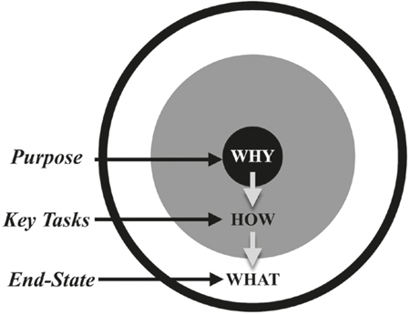
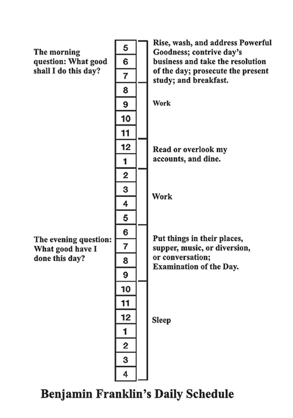
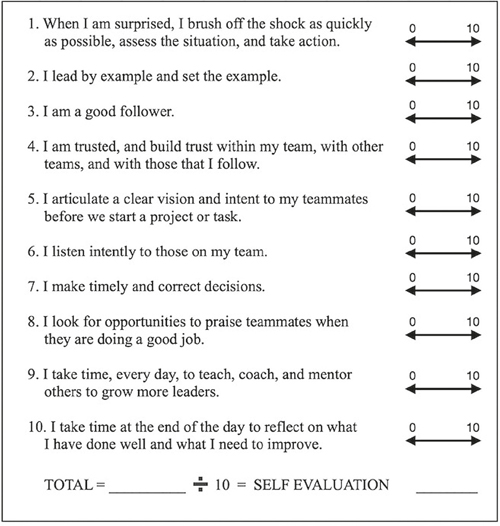
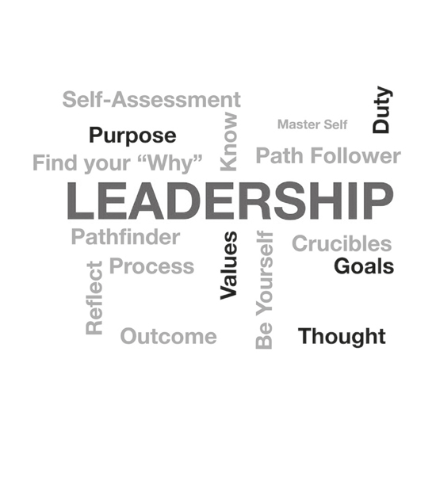

# 认识自己

第一步

忘记恐惧。忘记痛苦。继续前进。探路者继续前进，带领团队进入未知领域：狂野、危险和未知。雪覆盖了山。一些人被冻得瑟瑟发抖。他们迷路了吗？他们能活下来吗？如果没有路可以翻山越岭怎么办？几名球探寻找了传球，几乎都失败了。除了一个，那个人是纵队最前面的探路者。该团队跟随他们的领导者穿越荒野和危险的国家长达 10 周，才到达了这个陡峭的山坡。一路上死了几个人。这些人背着沉重的背包和斧头，艰难地爬上斜坡，每呼吸一口气。他们的力气已尽，即将放弃。
“继续前进，”探路者在纵队前喊道。 “前进，再多一点。差距很近。继续移动。”脚痛纵队在冰雪上挣扎，继续前行。探路者知道该去哪里，冲破茂密的树枝，标记要砍伐的树木，并绕过巨石。纵队像城堡的墙壁一样粗壮的松树挡住了他们的去路。探路者毫不犹豫地掏出斧头，开始砍伐。其他人打开他们的工具，开始工作。他们用锋利的斧头砍伐树木，打开小路，男人们继续前进。随着小路变窄，探路者为其他人指定了沿途避开的危险地点。经过艰苦的攀登，他们到达了山顶。在他们身后，是一条清晰的道路，其他人可以遵循。摆在他们面前的是他们的目标。一行人停了下来，屏住了呼吸，欣赏了壮观的景色。当金色温暖的阳光照在他们身上时，下面郁郁葱葱的土地显得庄严威严。他们的目光注视着壮丽的景色，一个如绿色诗篇在流动的山谷，宽阔的溪流旁有一排松树。男人们知道他们看到了一些其他人以前从未见过的东西。领头人指了指山谷的中心。
“这是我们的集结点。我们走吧。跟着我。”
这是一个真实的探险故事，发生在 1775 年 3 月，就在“全世界听到的枪声”在马萨诸塞州列克星敦开火、点燃美国革命的几个月前。 16 个月后，美国宣布脱离英国独立，成为一个新国家。带领这群开拓者进入这片未知土地的高大、坚强、谦逊的人是丹尼尔·布恩。他的团队一起开辟了一条道路，并在陡峭的阿勒格尼山脉中找到了一个缺口。阿勒格尼人一直是向西定居的障碍。只有少数探路者知道这条路。必须有人带路让其他人跟随，而丹尼尔就是那个人。这条小路陡峭、崎岖、狭窄，如果没有有人学过路，走过路，想象和传达目标，然后引导他们到达目的地：肥沃的农田和丰富的狩猎，他们永远不会成功肯塔基州的森林。
1775 年 3 月，丹尼尔·布恩 (Daniel Boone) 带领 31 名斧头兵探险队清理了一条被称为荒野小径的道路。根据斯图尔特·爱德华·怀特 (Stewart Edward White) 在他的经典著作《丹尼尔·布恩荒野侦察兵》(Daniel Boone Wilderness Scout) 中的说法：

> 起初，正如这些人所做的那样，只是一条小路，只适合驮马；但它的等级、穿过山口和穿越崎岖国家的路线的选择证明了布恩的实用眼光和工程知识。他以高超的技巧利用了水牛路、印第安人的踪迹、他自己的猎人踪迹以及印第安人的勇士之路，将它们连接起来，穿过森林和茂密的藤蔓，在远处燃烧一英里的树木。

1775 年 4 月，他的边防党完成了一座堡垒，该堡垒成为美国在肯塔基州的第一个定居点。为了纪念丹尼尔的领导，布恩斯伯勒堡被基督教化，这座堡垒最终发展成为一个定居点。 Wilderness Trail 的开发是美国历史上一个惊人的转折点，它开辟了新天地，开辟了令人兴奋的可能性。布恩斯伯勒很快成为更多先驱者的中转站，到 1800 年，最终有 221,000 名美国人在肯塔基州定居。丹尼尔的传奇故事是关于领导力的古老故事，在这个故事中，领导者学习如何指导和激励他人取得超出他们想象的成就。今天，你也可以成为一名探路者，将人们带到他们从未去过的地方，并带领他们实现他们从未想过可以完成的宏伟事业。
快进到21世纪。 2013年2月，一位特立独行的企业家陷入危机。他承诺提供尖端产品，但没有足够的现金流来支付工人的工资。为了避免破产，他召集每个员工并解释情况。客户已经承诺购买，但现在他必须在收到产品之前要求他们购买。他告诉他的团队，无论他们目前在做什么，他们的新工作都是说服客户预先付款并汇款。他还宣布，他将用个人资金以书面形式保证产品的转售价格，让每一位客户对交易充满信心。秘密地，作为最坏的选择，他去了一家大型科技公司，并询问他们是否会收购他的企业，以保持员工的工资和工厂的运营。在这些谈判中，奇迹出现了，这是他的领导所启发的。每个工人，无论他们以前的工作是什么，都专注于完成交易。有了保证转售价格的新承诺，他们签订了足够多的合同，使公司盈利。股价飙升。特斯拉汽车不再面临被出售的危险，在非凡的埃隆马斯克的领导下，还清了贷款，并朝着用全电动汽车取代汽油发动机驱动的汽车的梦想前进。
正如丹尼尔·布恩 (Daniel Boone) 在荒野中开辟了一条通往肯塔基州的新道路一样，白手起家的亿万富翁、经常被称为我们这个时代的托尼·斯塔克 (来自复仇者联盟的电影名人) 的马斯克也开辟了新的领域。马斯克的世界与布恩的世界完全不同，两个人就像斧头之于 iPhone 一样不同，但他们的领导力却有很多相似之处。像布恩一样，马斯克激励他人取得比他们认为自己能取得的更大的成就。就像过去的探路者一样，Musk 有着探索者的心和完成工作的不可阻挡的动力。马斯克是一位颠覆者、梦想家、非凡的领导者和创新者。创新需要使命，而马斯克提出的使命激发了积极进取的创新团队，这些创新团队正在颠覆包括全电动汽车、太空、能源和基础设施在内的多个行业。像布恩一样，马斯克是一个始终超出预期的领导者的例子。
无论是 Boone 还是 Musk，要完成任何事情，领导者都必须开始、执行和完成。入门很难。这是完成的最重要的一步。我们都找借口不开始，当我们这样做时，我们做的很少。不要永远花在计划、研究、调整情绪或准备上——只要开始！我们生活在一个充满干扰的世界。减少这些干扰，关闭侵入我们时代的过多屏幕，是一种专注的行为。总会有另一个小任务、电子邮件或短信来消耗你的注意力并分散你的注意力。开始是至关重要的。很多人都有好的想法、伟大的意图和异想天开的抱负，但除非你采取行动，否则什么都不会发生。对于每一次旅程，永远不要低估迈出第一步的重要性。决定行动，迈出第一步，是取胜的第一步。要学习、适应、成长和成功，你必须首先进入游戏。现在开始，稍后再迭代。做好准备，但不要等待完美的计划或情况。学习不需要卓越，但不开始就不可能学习。像布恩或马斯克一样，第一步之后的一切都是适应环境和利用机会。公元前 6 世纪左右，儒家学者老子所著的中国古代智慧书《道德经》说，一千里（一里大约等于三分之一英里）的旅程始于第一步。老子讲的是伟大的事业，要从卑微的开始。人们追随像 Boone 和 Musk 这样的领导者有很多原因，但主要是因为他们知道“为什么”的答案。
找出为什么

> “你生命中最重要的两天是你出生的那一天和你发现原因的那一天。”史蒂夫·哈维

在你的领导之旅中，你第一步也是关键的一步，就是花点时间反思并问自己这个重要的问题：“我为什么想成为一名领导者？”这是每个领导者都必须解决的基本问题。你越早发现你的为什么、分析它、了解它、从中学习并接受它，你就会越了解自己。了解你的原因需要认真思考、考虑和内部反思。与互联网上无数的引用相反，作家兼幽默作家马克吐温（塞缪尔·克莱门斯）从未说过：“你生命中最重要的两天是你出生的那一天和你发现原因的那一天。”我希望他有，因为这似乎是马克吐温可能会提供给一群细心的人群的那种精辟而有趣的俏皮话。取而代之的是，20 世纪的幽默作家和新闻记者史蒂夫·哈维在 2011 年将这句话及其与吐温的看似合理但不正确的联系带入了大众传播。无论这个想法来自吐温还是哈维，知道你的原因是一种强大的生活工具和一点智慧，我们必须接受它，因为所有的知识都始于自我认识。
畅销书作家、励志演说家和解说员 Simon Sinek 通过教人们找到他们的原因而取得了成功。 Sinek 消除了噪音，并传达了一个强有力的信息，即了解你的“为什么”的价值以及你应该从“为什么”开始的原因。他相信你的“为什么”是激励你做你所做的事情的目的、原因或信念。发现你的为什么会让你走。它是你的领导力燃料。如果你的原因足够有说服力，它可以激励其他人跟随你。 Sinek 相信大多数人都知道他们在做什么，有些人知道如何去做，但很少有人知道他们为什么要这样做。 “在我们脱颖而出之前，”Sinek 解释说，“我们必须首先明确我们的立场。”

> **人们为什么要关注你？**
>
> 人们在知道为什么应该跟随你之前不会跟随你，并且在他们了解你为什么要领导他们之前，他们不会相信你的领导力并满怀热情和承诺地跟随你。

Sinek 将这种原因、方式和内容的组合描述为黄金圈：“为什么”位于中心并与目的相关； “How”在下一环，是实现Why的方法； “什么”在外环上，是你为什么的结果，对应于结果、产品或最终状态。斯内克教导说，大多数人从是什么开始，然后是如何，最后是为什么，而且这个顺序本质上是有缺陷的。 Sinek 认为，有效的领导者从“为什么”开始，从“黄金圈”的中心向外工作。首先问一个重要的问题，“我为什么要做我所做的事情？是什么驱使我这样做？”旨在激发你做任何事情的动力，尤其是领导他人。正如 Sink 所说，“人们不会购买你所做的。他们购买你为什么这样做。”如果领导力就是影响力——领导者影响人们去追随——那么人们要想坚定地追随你，他们必须相信你的“为什么”。

Simon Sinek 的黄金圈——根据领导者的意图修改

在 Sinek 的图表中添加“目的”（原因）、“关键任务”（过程）和“最终状态”（结果）等词有助于解释黄金圈的含义。你的为什么与你的目的有关，你正在做的事情的原因。你如何做某事，是一个可以列为关键任务的过程。你的最终状态或预期结果是什么。如果你首先了解你的目的，那么关键任务和最终状态就会变得更容易可视化和创建。此“黄金圈”插图源自：Simon Sinek，Start with Why（纽约作品集：插图版，2009 年 10 月 20 日）第 37 页。
除非人们知道为什么要跟随你，否则他们不会跟随你；除非他们了解你为什么要领导他们，否则他们也不会满怀热情和承诺地跟随你。 Sinek 说：“如果你雇佣员工只是因为他们能胜任工作，他们会为你的钱工作。但如果你雇佣那些相信你所相信的人，他们会为你付出鲜血、汗水和泪水。” Sinek 也理解领导者和操纵者之间的区别：“影响人类行为的方法只有两种：你可以操纵它，或者你可以激发它……为什么可以帮助设定一个愿景来激励人们。 “为什么”可以指导我们有目的地、有目的地采取行动。”有目的的行动可以集中精力完成工作。当其他人退出时，目标会驱使你继续前进。它可以帮助你确定有意义的目标，并在重要和不重要之间确定优先级。如果其他人相信你的为什么，你采取行动的理由，它可以激励他们加入你的关注，你可以带领他们实现他们可能认为不可能的目标。
知道为什么要领导并有目的地行动的领导者决定了到达目的地还是原地踏步；在行动和不行动之间。领导者推动项目前进、想法实现、团队发展、企业盈利、国家成功。可怜的领导者可以把所有这些事情都毁了。控制欲强的领导者会导致混乱、浪费、困难、痛苦和痛苦。如果你为了错误的目的而领导，那么你实际上不是领导者，而只是一个操纵者。操纵者是指以聪明或不道德的方式控制或影响他人的人。在你终生的领导之旅中，你会遇到许多操纵者。了解领导者和操纵者之间的区别对你来说至关重要。操纵者认为，领导力只是一袋花招，里面装满了胡萝卜和大棒，用来引诱或强迫人们服从他们的命令。操纵者本质上是愤世嫉俗者。操纵者和领导者之间的不同之处在于领导力的灵魂。
我的导师之一、领导力作家和专家约翰麦克斯韦认为，理解你的为什么归结为人们需要知道的三个问题：“你关心他们吗？你会帮助他们吗？他们能相信你吗？”这三个问题针对你的“为什么”的核心。如果他们了解你的原因，并相信你的目的，人们就会跟随你走向星空。麦克斯韦说，了解你的目标是在领导和生活中取得成功的关键。成功人士知道他们的人生目标。这些人花时间思考、表达和写下他们的目的。写下他们的目的的行为是一种强大的专注行为。他们的目的始终是进行中的工作，在他们的领导之旅中进行回顾和磨练，但它很有用，因为它就像一颗引导星，让他们走上正轨。简而言之，他们了解他们的原因，这会产生信心。知道为什么是强大的。它是影响力的来源。如果你知道你的原因，你就可以自信地领导。

> 认识你自己
>
> “认识自己是一切智慧的开始。”亚里士多德

认识自己是什么意思？了解自己如何帮助你学习、面对挑战和克服困难？如果了解自己是成功领导的核心，那么了解你的原因将有助于你更多地了解自己。你如何发现你的为什么？问这个问题：我想留下什么遗产？如果你能回答这个问题，你就向了解自己迈出了重要的一步。以你希望被记住的方式生活。如果你这样做了，那么你就走上了成功生活的道路。你还将解锁了解自己的钥匙。伟大的古希腊哲学家苏格拉底说过，最伟大的格言是“认识你自己”。正如罗纳德·格罗斯 (Ronald Gross) 在他的书《苏格拉底的方式：使用头脑的七个关键》（企鹅出版社，2002 年）中所说的那样，“苏格拉底并没有 [原文如此] 争辩说跟随他是‘道路’——只是一种找到自己道路的方式......正如苏格拉底所证明的那样，我们只有通过与他人的关系才能最充分地成为自己：朋友、导师以及我们所爱的人和爱我们的人。”伟大的苏格拉底的学生亚里士多德将这个想法更进一步，他说：“认识自己是一切智慧的开始。”

## 坩埚

通过成功地穿越坩埚，你可以最好地了解真正的自己。每个人都有挑战和困难。当你了解自己的构成时，通常是在这些困难时期对你进行严峻考验。坩埚是一种严峻的考验并导致创造新事物的事件或情况。根据 Merriam-Webster 词典，“坩埚”一词似乎与罗马拉丁语中的十字架有关，但它源自中世纪的拉丁语单词 crucibulum，这是一种用于熔化金属的特殊耐热陶罐的名称.在坩埚中，金属与其他液化金属融合。结果是一种更坚固、更坚韧和更有弹性的合金。我们每个人都有一种抗拉强度，我们可以通过纪律和实践来增强这种弹性。一个巨大的挑战可以成为一个考验你的坩埚。当事情变得困难而其他人退出时，是什么让你坚持下去？

> 坩埚
>
> 你会经历生活中的艰难时刻。每个人都会经历挑战和艰辛。将挑战转化为学习体验是优秀领导者的关键能力。

美国陆军游骑兵学校就是我所经历的坩埚的一个例子。游骑兵学校是陆军中最艰苦的学校。只有少数人获得了梦寐以求的 Ranger Tab，这是一种制服徽章，使佩戴者成为世界上最强大的领导力课程之一的毕业生。我永远不会忘记我抵达佐治亚州本宁堡接受游骑兵学校挑战的那一天，这是一门为期 61 天的战斗领导力课程。我在 8 月的第二天报到，温度高得足以融化钢盔上的油漆。那天早上我们进入游骑兵学校时，有 216 名游骑兵候选人和我站在一起。六十一天后，不到一半会毕业。
在接下来的两个月里，我们睡得很少，吃得更少，在黎明前跑了无数英里，在被亲切称为“虫坑”的泥泞障碍赛场上忍受了无数小时，遭受了无数次的骚扰、指导和检查，执行了数十个引体向上和引体向上，与数百个俯卧撑作斗争，所有这些都是由一群铁杆、脾气暴躁的游骑兵教练严格要求的，他们的人生唯一目的似乎是说服我们放弃。每个游骑兵候选人都是志愿者，可以随时退出培训。为了结束疯狂，游骑兵候选人只需说“我退出”，痛苦和迫害就会结束。凌晨 3 点不再以 15 英里的节奏跑步，不再有 3 小时的睡眠时间。乔治亚州 100 华氏度的高温让你全神贯注，汗水从你的脸上滴落，不再有游骑兵教练对你大喊大叫。几个候选人在第一周就辞职了，我们再也没有见过他们。其他人则退出，因为身体和精神上的压力让他们付出了代价。到第二周，我们减少到大约 170 名游骑兵候选人。
为了毕业，每个人都必须完成三周的本宁阶段、三周的山地阶段和三周的佛罗里达沼泽阶段。在这个严峻的考验中，我了解到生活中的幸福与睡眠有很大关系——不多也不少。我们一天只吃一顿饭，通常是战斗“C”口粮或脱水的远程巡逻口粮；每个人都减肥了。当我们互相交谈时，谈话不可避免地转向了睡眠和食物。我的一些游骑兵伙伴开始列出他们毕业后会吃的所有食物。培训不间断地继续进行，游骑兵干部在整个过程中的每一步都考验着我们作为领导者的身份。每个候选人必须成功领导多支巡逻队，该巡逻队由 12-50 名游骑兵候选人组成。每一次巡逻都是一次领导力测试，领导成功的巡逻需要毕业。如果你一次巡逻失败，干部可以再给你一次领导的机会。第二次或第三次罢工，你就会被淘汰出局。 10月份毕业时，为什么原来的216名候选人中只有106名成为游骑兵？答案是：每个人的性格、能力和承诺决定了他的命运。在课程结束时，我们知道我们是谁，我们为什么在军队中，需要领导什么，以及我们如何克服任何困难，无论多么严峻。我们知道自己的长处和短处，并认识到我们已经获得了适应、即兴发挥和克服任何挑战的信心。我们意识到游骑兵学校的教官是我们军队中一些最优秀的领导者，我们所忍受的是终生的礼物。在这个坩埚之后，其他一切似乎都很容易。

> 先引导自己
>
> 如果不首先领导自己，你就不能成为探路者。了解自己，领导自己，然后领导他人。

我从游侠学校学到的一个基本教训是，我们都面临着生活的考验。我们如何适应、即兴发挥、克服和忍受是衡量我们领导力的标准。在你的领导之旅中，你将面临多种考验你的挑战。如果你接受这些经历，你就可以成长并学会克服更大的挑战。
发现真正的自己比听起来更难。正如约翰麦克斯韦所说：“要成长，你必须了解自己。”如果你知道自己的弱点，学会避免诱惑，知道如何克服挑战，你就会变得更强大。如果你了解自己的长处，就可以强化这些品质，从而为自己和周围的人带来最大的好处。了解你在困难情况下将如何行动和反应将建立信心。如果不首先领导自己，你就不能成为探路者。了解自己，领导自己，然后领导他人。

> **掌握自己，先了解自己**
>
> 了解自己、自己的长处和局限性是有效领导者的关键属性。
> 了解自己和竞争对手对胜利至关重要。
> 了解自己意味着了解自己的长处和短处。

## 掌握自己
《孙子兵法》是中国古代关于战略和竞争的论文，作者是公元前 6 世纪中国传奇将军、作家和哲学家孙子。它已成为军队、政府、顶级商学院和获奖首席执行官 (CEO) 领导力的永恒指南。这项工作代表了一种深刻的哲学，可以在多个层面和生活的各个领域赢得任何冲突。正如最近对孙子的优秀研究《孙子兵法》的作者杰西卡·哈吉 (Jessica Hagy) 所说：
近几个世纪以来，它不仅成为军事战略的必读书籍（显然），而且还成为在商业、政治、管理、营销、后勤规划甚至体育领域进行统治的首选指南……战争之所以广受欢迎，是因为孙子的见解适用于所有的冲突，无论大小……它不是关于战争，而是关于解决问题——这是一个元隐喻。战争只是你生活中遇到的所有麻烦的代名词。

孙子在《孙子兵法》中说：“故曰知敌知己，百战不殆。如果你只了解你自己，而不了解你的对手，你可能会赢也可能会输。如果你既不了解自己也不了解你的敌人，那么你将永远处于危险之中。”了解对手是关键，因为我们从竞争中学到了一切。了解自己意味着了解自己的长处和短处。了解自己和比赛是胜利必不可少的。
孙子兵法强调先学后领导，先了解自己、对方和环境，然后再做决定和行动。克服竞争并为团队取得成功是领导者的最终状态。在商业世界中，竞争者可能是另一家公司，也可能是涉及资源有限且期限紧迫的困难项目的情况。在战争和竞争中，这涉及到目标对立的竞争者。了解自己的领导者会做出更好的选择，他们的决策成为他们领导力的引擎。根据孙子的说法，一个成功的领导者学会了在团队中加入合适的人来弥补领导者的弱点，增强领导者的优势。这种思维使团队变得比其各个部分更强大，因为团队加强了领导者的积极品质并弥补了领导者的缺点。 6 世纪儒家学者老子着有《道德经》，译为《道与德》，他说：“掌握他人就是力量。掌握自己才是真正的力量。”如果你了解自己，你就知道要走哪条路，你就可以设定路径。

> **精通**
>
> “了解他人就是智慧；认识自己才是真正的智慧。掌握别人就是力量；掌握自己才是真正的力量。”老子

了解自己如此令人恼火和困难的原因之一是我们人类的自欺欺人倾向。避免自欺欺人需要将自我与现实分开。这不是一个小任务。马克吐温相信领导者必须“了解你自己”，并在他的自传中写道：“当一个人无法欺骗自己时，他就不可能欺骗别人。”他继续说道：“当我们思考自己时，我们不会处理太多事实。”了解自己也有助于你掌握其他事物。美西战争的英雄、美国第 26 任总统西奥多·罗斯福说：“除非一个人能掌控自己的灵魂，否则所有其他类型的掌控都无足轻重。” 20世纪颇有影响力的领导力学者、作家拿破仑希尔说得最好：“如果你不征服自我，你就会被自我征服。”
本杰明·富兰克林是他那个时代最伟大的人物之一、美国的开国元勋和《独立宣言》的合著者，他说：“三样东西极其坚硬：钢铁、钻石和了解自己的自己。”富兰克林在很小的时候就开始了自我意识之旅。他的人生是一个关于自我完善、发现、终生学习和领导的精彩故事，值得研究。富兰克林出身贫寒，是一个肥皂和蜡烛制造商的儿子，有 17 个孩子。年轻的本杰明在他哥哥的印刷厂当学徒之前只接受了两年的正规教育。富兰克林是一个探路者，而不是一个追随者。他被书包围着，变成了一个贪婪的读者，把他能找到的每一本书都吃光了。他想了解一切，成为自学成才的知识分子和博学者，从未失去共同点。他自学成为一名专业的作家和传播者。他的年鉴《穷理查年鉴》成为十三个殖民地最重要的单一知识点之一，从 1732 年到 1758 年，每年销售近 10,000 册，当时书籍是由手动印刷机印刷的。
富兰克林努力改善自己的身心，并成为著名的运动员。在他那个时代，大多数人不会游泳。富兰克林通过跳入费城的 Schuylkill 河并游泳越来越长的距离来自学游泳。他的游泳功绩成为传奇，并最终在 1968 年得到认可，当时他被追授为国际游泳名人堂的名誉成员。富兰克林去世 178 年后仍在制造新闻！除了游泳，富兰克林还是一名健美运动员。他凭直觉知道他的身心是同一个系统的一部分。
富兰克林是一个很好的例子，说明“学习如何领导自己”使你能够领导他人。 18世纪，他成为了今天的约翰·格里沙姆（畅销书作家）、戴夫·拉姆齐（金融作家和反债务传播者）、比尔·盖茨（发明家、技术专家和慈善家）、杰夫·贝索斯（企业家）、埃隆·马斯克的组合（多行业颠覆者）和纳尔逊曼德拉（政治领袖）合二为一。他是一个自学成才的人。他从非常卑微的开始就实现了这一目标，被自己对学习、探索和领导的热情所激发。在他的众多成就中，他是科学领域的领导者（因发现电而受到赞誉）；发明（他发明了双焦点眼镜、摇椅、富兰克林炉等等）；慈善事业（他捐赠了费城图书馆）；政府（他成立了第一家志愿消防公司、第一家医院，作为联合邮政局长，他在 1760 年首次使美国十三个殖民地的邮局变得有效和盈利）；并且是美国革命和争取从英国独立的斗争中的核心政治领袖。富兰克林将他的成功归功于首先了解自己。引用他的话说：“观察所有人；你的自我 [原文如此] 最。”

> **选择成为探路者**
>
> 你对自己的优势和劣势了解得越多，就会越了解需要改进和强化哪些领导力要素。如果你真正了解自己，你就能学会领导他人。领导者是探路者。探路者学习路径，走路径，并引导他人到达目的地。

如果你真正了解自己，你就可以通过学习道路，走这条路，引导他人到达目的地，才能学会领导他人，成为探路者。认识道路成为认识“自我”的练习。正如老子所说：“知人者明；认识自己的人有洞察力。”如果你想成为一名出色的领导者，首先要为自己努力。
获得自我意识的最好方法之一是提出正确的问题。让他们保持积极的态度，你通常会找到同样肯定的答案。富兰克林会以这样一个问题开始他的一天：“我今天要做什么？”并以这样一个问题结束了他的一天：“我今天做了什么？”他对自己做得好的事情不感兴趣。他对那天做了什么好事很感兴趣，因为他觉得做好事会对其他人、他的社区、他的国家和世界产生持久的影响。

> **为自己工作**
>
> 如果你想成为一名出色的领导者，首先要为自己努力。

富兰克林发明了许多有用的装置，包括避雷针。他对电很着迷，想了解它的力量。在 18 世纪，富兰克林是一个“风暴追逐者”，因为他会骑马，在夜晚的黑暗中狂奔，进入闪电风暴下的地区。这对我们来说似乎很了不起，因为我们认为我们的知识是理所当然的，但是在 18 世纪，人们并不确定闪电是放电还是其他东西。富兰克林想知道闪电是否是电，他开发了许多实验来证明这一点。他把他的家变成了一个实验室来研究这种现象，对电的研究一度成为他唯一的关注点。在一次实验中，他不小心被“从头到脚的全身一击，似乎内外都受到了打击；之后，我注意到的第一件事是我的身体剧烈快速颤抖。”
1752 年 6 月，富兰克林在闪电风暴中进行了著名的带金属钥匙的风筝实验，并举着风筝线，而他 21 岁的儿子威廉则站在附近作为证人。在这个危险的实验中，富兰克林看到琴弦上的琴键因电而闪烁，并意识到闪电的本质：它是电！幸运的是，富兰克林在这些实验中幸存下来，通过这些经历，他学会了保护建筑物免受雷击危害的方法。经过更多的实验，富兰克林设计了铁制的避雷针——避雷针——可以“捕捉”闪电，沿着金属线携带电荷，然后安全地将其吸入地下。富兰克林在日记中写道：

> 通过指导我们将直立的铁棒固定在这些建筑物的最高部分，这种点的力量的知识对人类没有用处，以保护房屋、教堂、船只等免受雷击变得像针一样锋利……这些尖头的棒子难道不会在电火接近击中它之前从云中悄无声息地抽出电火，并保护我们免受最突然和最可怕的恶作剧！

制作避雷针是一项了不起的成就，富兰克林本可以卖掉这个想法并立即变得富有。 相反，他渴望尽善尽美，将自己的发明无偿赠送，在这一举动中，他不仅保护了无数建筑物免受雷击的破坏，挽救了数千人的生命，而且后来被认为既善良又聪明 .

对于富兰克林来说，行善意味着为他人或为比自己更伟大的事业做某事。富兰克林明白认识自己的力量。他利用每天的反思来进一步了解自己。通过每天晚上用“我今天做了什么好事？”这个问题来检查自己的行为，他教会自己让自己的行为与目标保持一致，并充分利用他的可用时间来造福自己和他人。通过这种方法，富兰克林可以发挥他的创造能力和领导力来做巨大的好事。他制定了一份每日清单，专注于每天做好事。虽然没有证据表明富兰克林学习了中国的《道德经》，但他终其一生都明白：“了解他人是智慧，了解自己才是真正的智慧。”你越是真正了解自己并不断寻求自我提升，你就越能更好地领导他人。你对自己的长处和弱点了解得越多，就越知道该做什么，该防备什么。

> **每日反思**
>
> “我今天做了什么好事？”本杰明·富兰克林

## 自我评估

自我评估很难。想象一下，你正在为一项至关重要的工作面试自己。你正在申请 LeadXYZ 的领导职位，这是一家潜力无限但只有几十名员工的新初创公司。 LeadXYZ 为全球的组织领导者提供领导力辅导、培训和教育。 LeadXYZ 已准备好扩展并拥有推出新产品的资金。你正在接受一份工作的面试，该工作将涉及创建和领导一个 25 人的专家团队。你的团队将成为公司的前沿，他们的“团队”。你将需要雇用和发展你的团队。你的组织的成功和公司的生计将取决于你的领导能力。
在你的脑海中，回顾你过去的领导经验，并将它们投射到 LeadXYZ 的这种新情况中。无论你以前是否有领导过一个小团体、一个大团队或你的家庭成员的经验都没有关系。将自己置于领导“A 团队”的场景中。
在反思这种情况并将你自己的领导力在行动中可视化之后，是时候在第 19 页的“领导力自我评估评级”表上对你的领导力进行评级了。这个练习对新晋和有经验的领导者都很有价值。要进行适当的自我评估，请在选择 0 到 10 之间的数字之前思考并反思这些陈述，其中 10 是最佳评级。计算评估结束时的数字并将该数字除以 10。这就是你的领导力评级。将其标记在标题为“领导力自我评估”的后续页面上。

> **领导自我评价评级**
>
> 为以下 10 个问题中的每一个给自己打分，1 到 10，其中 10 是最高和最好的结果。然后，将所有十个问题的总和相加，然后将该数字除以十。这是你在 1-10 范围内的领导力自我评估。

LeadXYZ 会雇用你吗？如果你的评分低于 10，请不要难过。我从来没有遇到过完美的 10 级领导者，但我知道一些接近的领导者。如果我给他们看这个量表，并告诉这些“顶级”领导者我给他们打了 9 分或 10 分，几乎所有人都会告诉我，我给了他们比他们应得的更多的赞美，因为他们还有很多东西要学。这也是我对他们评价如此之高的原因之一。你的评分是你认为自己现在是谁的快照。如果你给你领导的人或熟悉你的人同样的评级，评级会有多少不同？这似乎是一个微不足道的问题，但它是了解你是谁的核心。这种差异是我们如何看待自己与他人如何看待我们之间的差异。如果变化很大，那么反思你所说的是否真的是你所做的。言行的关系是信任的基础。

> **智慧与智慧**
>
> “知人者智，自知者明”  --老子

到目前为止，你已经了解到领导力是一段旅程，它代表了你和你的团队之间的动态关系。你的领导力评级会随着你领导的每种情况和不同的团队而上下波动。如果你了解自己并反思自己作为领导者的长处和短处，则可以不断改进并学习快速适应新的领导情况。考虑这个评级并与可信赖的朋友讨论以获得另一个观点。当你继续阅读本书时，请记住这个初始评级。
在自我评估之后，要问的关键问题是：“你了解自己吗？”如果你这样做了，你就有了自我意识并了解自己的长处和短处。了解你的长处和短处，你可以通过让团队成员最大限度地减少盲点并在他们看到风险时通知你来弥补缺点。了解自己的优势会让你有信心取得成功。如果你不知道自己的长处和短处，用对自己能力的错误印象来欺骗自己，那么你的幻想可能会在现实世界的熔炉中破灭。为避免这种情况，请像在自我评估中所做的那样进行反思，并定期进行评估。随着年龄的增长，你会改变，并在此过程中获得知识和经验。结合这两者提供了智慧的可能性。没有比认识自己更大的智慧了。人生苦短，如果不花时间反思，就会变得更加艰难。反思你的一天并分析你的日常领导行为的影响是一个强大的工具，你可以用它来评估你自己的领导之旅。
古代雅典剧作家和剧作家米南德就如何认识自己提出了极好的建议：“认识你自己意味着你熟悉你所知道的，以及你能做什么。”请注意，重点是你可以做什么，而不是你不能做什么。作为领导者，你经常会听到你的队友抱怨他们做不到的事情。这是一个借口。领导者专注于他们能做什么，不要浪费时间思考“不能”。知道你知道什么和你能做什么提供了一种可以呈现洞察力的模式。磨练你对自己的看法是一个宝贵的推动因素。你的自我评估是对你的领导力的初步评估。读完这本书后，你再做一次这个分析，看看你对自己的评价会很有用。你还应该使用此自我评估工具让其他人对你进行评分，并向你提供他们对你的领导能力的看法。你的自我评估可能与他们的评级相符，也可能不相符。这是因为我们对自己的考虑多于对他人的考虑。作为不完美的人，我们经常为自己的消极行为辩护，而我们永远不会让别人逍遥法外。因此，诚实地评估你的领导力是很费力的，但如果你从不尝试，这是不可能的。从他人那里获得坦率的反馈是帮助你建立自我意识的绝佳工具。
让自我评估成为一种习惯，就像富兰克林每天晚上所做的那样，是了解你是谁以及你的领导能力的有效方法。每天留出一些时间来反思你作为领导者的个人行为和成长，可以改善你的自我形象和信心。如果你想养成良好的领导习惯，请每天抽出五分钟不间断的时间进行反思和自我评估。这样做并花一些时间思考的行为可能会非常有说服力。远离所有干扰，设定一个专注、思考和反思的时间。思想就是能量。你成为你所想的。凭借思想的力量，我们的思想可以形成和重组突触连接，尤其是在响应学习或经验时。这被称为神经可塑性，许多职业运动员都知道并实践过。这是你提高绩效水平的手段。每天短时间的反思可以改变你的思维方式，并帮助你养成新的积极习惯。创造一个安静的空间，留出不受干扰的时间，让你的思想完全专注于一个目标，从每一天中学习，并承诺成为一个比前一天更好的领导者和更好的人。问问自己：我今天做了什么？我什么做得好？我学到了什么？
在每一次自我提升的努力中，时间是关键的鉴别器。每一天，我们都被分配了相同的时间。忙碌和做一些富有成效的事情之间有着巨大的区别。如果你非常想要某样东西，你可以屏蔽所有干扰和干扰，专注于掌握所需的技能或目标。例如，赢得早晨，你就有更好的机会赢得这一天。每天早上先处理你最重要的任务，你会完成更多。每天准备好充分利用你作为领导者的时间。如果你想成为世界一流的领导者，请花时间反思并从你一天的行动中学习。明智地利用这段时间，以专注、坚持和不分心的方式，是你作为领导者成长的基础。约翰·麦克斯韦 (John Maxwell) 是这样说的：“不成功的人背负着学习的负担，更愿意走熟悉的道路。他们对学习的厌恶阻碍了他们的成长并限制了他们的影响力。”如果学习对你来说是一种负担，那就改变你的想法。学习对成长至关重要。从未停止学习。

> **想法**
>
> 思想就是能量。你成为你所想的。凭借思想的力量，我们的思想可以改变形式，并重新组织突触连接，尤其是在响应学习或经验时。

马可·奥勒留（Marcus Aurelius）是斯多葛派哲学家和罗马皇帝，他在公元 161 年至 180 年期间领导了帝国及其军团，他认真地认识自己。历史将马库斯描述为罗马“五位好皇帝”中的最后一位。他从繁忙的日程中抽出时间研究自己的领导能力，并每天反思自己的行为。在战争中，马库斯与他的军团一起对抗罗马的敌人，他写下了他每天的沉思。他写这些不是为了出版，而是让自己分析他作为领导者和皇帝的日常工作。这些作品代表了他内心深处对自我提升以及如何成为更有效的领导者和更好的人的想法。马库斯去世将近一千三百年后，他的 12 卷卷轴以《沉思录》的形式出版。马库斯认为，你永远无法绝对确定地真正了解自己，但你可以充分了解自己，做自己。马库斯的冥想强调了反思的力量，可以改善你作为领导者的性格、能力和承诺。马库斯认为个性是“发展的自我”。他了解专注思维的力量及其对领导力发展的影响。他在《禅定》中说：“习以为常的念头怎样，你自己也怎样；因为灵魂被它的思想染上了颜色。”马库斯推断，优秀的领导者会发展并努力“做你自己”。几个世纪后，最伟大的英语剧作家和作家威廉·莎士比亚创造了马库斯·奥勒留所讨论的这句话：“对你自己来说是真实的。”

> **做自己**
>
> 在《沉思录》中，马库斯·奥勒留 (Marcus Aurelius) 意识到，你永远无法绝对确定地真正了解自己，但你可以充分了解自己以做自己。

了解自己是提高领导意识的重要一步。美国学者、组织顾问和领导力作家沃伦·本尼斯这样说：“成为领导者就是成为自己的同义词。就是这么简单，也就是这么难。”自我意识是成为领导者的重要组成部分。 e. e. 20 世纪著名的美国诗人和散文家卡明斯曾说过：“长大并成为真正的自己需要勇气。”本尼斯和卡明斯都学会了“了解自己”的力量，并利用这种意识通过写作和教学积极影响他人。
Thomas Hout 和 John C. Carter 在《哈佛商业评论》中的一篇文章“完成工作：高级管理人员的新角色”总结道：“高级管理人员善于倡导变革，但不善于改变自己。”这篇 1995 年的文章解决了当代领导力挑战，证明了领导力冲突的持久性。它是如此相关，以至于它在 2020 年重新发布。高层领导人之间的反思似乎是非典型的，这个主题强化了领导者只有三种类型的讽刺格言：使事情发生的人；那些观察事情发生的人；以及那些想知道发生了什么的人。可怜的老板符合这条公理的所有三类，当他们让事情发生时，他们这样做是以牺牲团队中的人为代价的。上司很容易以牺牲下属为代价来完成任务。杰出的领导者试图创造双赢，他们专注于使事情发生并提升团队成员。看到这枚硬币的两面，完成使命并照顾他们的人民的领导者是特殊的。了解这种对比是提高领导意识的重要一步。

## 经理和领导

我们大多数人都为坏老板工作过，因为他们在每个职业中都很普遍。在商业中，一种常见的企业心态是推动而不是领导。老板强迫他们的员工专注于“底线”，“创造数字”。他们将不惜一切代价推动人们完成这些指标，包括破坏团队和迫使员工离职。 “雇佣和解雇”是太多企业和组织的口头禅。一个组织衰落的明显迹象是，当你注意到每个人都忙得无法思考时；有太多的会议很少解决问题，没有人提出问题以避免被分配额外的任务。团队领导者在眼前的任务上工作过于努力，以至于他们无法培养员工以确保长期成功。老板在一个始终关注短期任务而不是长期目标的环境中茁壮成长。因此，老板很常见。

> **你是老板、经理还是领导者？**
>
> 如果你给我展示一个成功的团队，我会给你展示一个杰出的领导者。如果你给我展示一个苦苦挣扎的团队，我会给你展示一个需要学习领导的老板。管理器同步资源。领导者带领人。你是领导者、经理还是老板？

你决定你是老板还是领导。在我们对领导力的研究中，我将老板定义为支配团队并操纵他们的目标感以实现个人进步的人。老板如何成功？这是许多鼓舞人心的领导力研究都回避的问题，但要理解这一矛盾，就必须同时解决领导力的积极和消极方面。为了区分以牺牲团队为代价完成任务的老板与既赢得任务又提升团队的领导者之间的差异，让我们来看看经理、领导者和老板之间的区别。
管理者可以而且应该领导，但并非所有管理者都是领导者。经理在时间、地点和目的上协调资源的活动。管理人员对组织至关重要，因为他们使流程发挥作用并解决每天发生的无数温和问题（第 6 章“通过学习如何决定来塑造你的命运”中将详细介绍这些问题）。管理者协调的主要资源是人员、时间和金钱。如果他们将这些资源用于实现适当指定的目的，他们通常会保持组织正常运转。如果他们不这样做，我们就会认为他们是糟糕的管理者，因为他们无法有效地同步人员、时间和金钱的活动。遵循这个过程常常成为思考的替代品。领导力需要更高层次的思维，因为领导者必须解决流程未定义的问题。因此，一个好的管理者不一定是一个优秀的领导者。

> **经理**
>
> 经理在时间、地点和目的上协调资源的活动。管理人员对组织至关重要，因为他们控制工作流程和流程，并解决每天发生的无数棘手问题。

管理和领导之间的区别在于它们各自角色的目的。经理管理事情。当人们感觉自己被当作商品对待时，他们就不喜欢被管理。大多数人更喜欢被领导而不是被管理。他们希望被视为独一无二的人，而不是被归入消耗性资源的范畴。像对待商品一样对待员工的经理可能会在时间、地点和目的上有效地协调他们的行动，但很少获得创建高绩效团队或组织所需的有效性。
资源管理很重要，优秀的管理者可以让组织保持运转。每个团队都需要高效的管理者，但效率并不是最终状态。效率被定义为最少的资源浪费。效率是可衡量和可重复的，这就是为什么它对任何组织都如此重要。效率意味着一加一加一等于三（1 + 1 + 1 = 3）。我们可以衡量效率，通过有用产出与总投入的比率定量得出。由于时间和金钱资源是许多企业的底线，管理人员密切关注这些资源。大多数企业花费大量时间和精力来培训他们的经理并创建等级制度来监督经理的工作。大多数组织还制定了详细的规定和精确的程序，以指导经理在每种可以想象的情况下如何行动以及做出什么决定。管理人员是流程机器中的重要齿轮。不遵守规定的经理将受到纪律处分、重新分配或解雇。简而言之，管理者执行流程，遵循指示，遵守规则。效率的衡量标准是以最少的资源支出完成工作。
单个部分的效率并不能保证团队的效率。效率是对资源的最佳利用，对于团队而言，是对团队人力资本的最佳利用，以实现更高的效率。实现有效性是为了获得最高的结果。有效性意味着一加一加一大于三（1 + 1 + 1 > 3）。当一个团队不仅仅是其各部分的总和时，它就证明了有效性。埃隆马斯克相信效率是一种心态。据 2015 年采访马斯克的蒂姆·厄本 (Tim Urban) 称，马斯克认为这种心态类似于厨师和厨师之间的区别。厨师根据数字遵循食谱，测量每种成分并按照分步说明中列出的过程进行应用，然后制作可口的饭菜。任何完全遵循食谱的人都可以复制这道菜。我们需要并欣赏好厨师。另一方面，厨师积累基本食材，并凭借经验、灵感和创造力，组装一道主菜，成为一种烹饪体验。厨师对每顿饭进行实验，对他们的烹饪愿景提出假设并进行迭代，添加一点点，然后再添加一点点，直到厨师实现愿景。只有厨师才能创造美食。基本的区别在于厨师专注于效率，而厨师专注于效率。一个复制，另一个创建。两者都有价值，但注重效率的领导者可以将他们的团队转变为高绩效的组织，而不仅仅是各个部分的总和。
人们追随领导者，服从管理者。领导者也必须管理资源，但他们不把人当作东西，而是领导他们。领导者对效率和效力都感兴趣，在大多数情况下，效力胜过效率。领导者不仅将他们的追随者视为重要的资源，而且将其视为任何团队或组织的基本和核心要素。作为团队的一部分，领导者尽其所能与员工沟通并促进他们的发展。对于任何团队、组织或企业来说，领导力都比管理更重要，因为管理——在时间、地点和目的上协调事物——只是等式的一部分。管理者可以是领导者，但领导力要求管理者超越资源和流程的世界，进入人员和互动的世界。

> **领导**
>
> 领导者不仅将人视为重要资源，而且将其视为任何团队或组织的基本和核心要素……对于任何团队、组织或企业而言，领导力都比管理更重要，因为管理——事物在时间、地点的协调和目的——只是等式的一部分。

因此，培养领导者比培养管理者要困难得多。难题在于，领导力同时是任何组织中最便宜和最昂贵的资源。当你拥有高效的领导者时，你的组织可以取得超出预期的成就。当你有糟糕的领导者——老板——你的组织通常会做最少的事情来让老板高兴。因此，领导力在发挥作用时似乎没有任何成本，但当没有领导力时，成本确实很高。能够分享组织愿景、能够传达该愿景并能够激励人们实现该愿景的领导者是无价的。培养这些领导者需要对人员进行大量投资，当组织做出这种选择时，结果可能是巨大的。
许多人错误地将所有经理都定义为领导者。当语言不准确时，思维就会模糊。仅仅遵循流程、程序和规定的管理人员几乎没有个人判断的余地。采取主动的管理人员是领导者，应该被认可。了解流程、程序和法规，但也有权带领员工超越这些限制并按照组织的整体意图行事的领导者，可以加快决策过程并取得仅对管理者来说是不可能的成功.
可怜的领导者将自己的角色内化为操纵和胁迫的艺术，他们是老板。老板没有追随者，只有棋子。被当成棋子对待的人很少采取必胜的承诺，他们只是做他们需要做的事情来度过难关。领导力教练肯布兰查德是畅销书《一分钟经理》（HarperCollins，1981 年）的合著者，他说：“在过去，领导者是老板。今天的领导者必须与他们的人民合作……他们不再能够仅仅基于职位权力来领导。”他说的是伙伴，不是哥们，他是对的。很少有人想要一个老板，但他们正在寻找一位领导者，对他们、团队和他们的长期成功做出承诺。老板可以把事情做好，尤其是在短期内，因为他们花费人力和资源来实现短期目标。在商界，有句老话：“员工不是辞掉工作，而是辞掉了老板。”正如作家西蒙·斯内克 (Simon Sinek) 所说，“老板拥有头衔。领导者有人民。”
了解自己是学习如何成为领导者而非老板的第一步。 “在你存在的中心，你有这个问题的答案；你知道你是谁，你知道你想要什么，”畅销书作家、全球高级管理人员和企业家的执行教练 M. J. Ryan 写道。如果你想成为探路者，请超越成为经理，避免成为老板，并学习领导。尝试。没有努力，就没有成长，就没有成就，就没有心灵和心灵的舒展。领导者不断前进，以让他们想要追随和成长的方式影响他们的队友。探路者通过了解自己的身份并对自己的能力充满信心，从而在艰难时期获得力量。正如约翰麦克斯韦所说：“如果你不跟随自己，其他人又何必呢？”
你是追路者还是探路者？大多数人是道路追随者；他们寻找一条可以遵循的路线，并且更喜欢一条内衬有指示通往目的地的路标的路线。他们希望有人走在他们前面，给他们指路。 “领导者，”Simon Sinek 说，“是那些有勇气走在前面并为其他人开辟道路的人。”开辟一条危险的、新鲜的道路需要巨大的勇气——想象一下丹尼尔布恩的勇气，他的团队在荒野小径上进行了砍伐。沿途没有休息站、餐厅或舒适的旅馆。每一个转弯处都潜伏着危险，前进的道路并不确定。任何人都可以猜出要走哪条路，但需要像丹尼尔这样的领导者才能将团队带到正确的目的地，并沿着其他人可以跟随的方式设置集结点。在这种情况下，团队会寻找一个领导者，他将成为他们的探路者；学道、展示道、走道的人。领导力的标志是路径追随者和探路者之间的对比。
正如约翰麦克斯韦所说：“领导者知道道路并指明道路。”了解你的原因并理解你的目的，会让你对方向有坚定的信念，让你在最猛烈的风暴中保持稳定。因此，找到原因的那一天是你了解自己并成为领导者的第一步。下一步是通过定义你希望理解的内容来遵循苏格拉底的智慧。在下一章中，你将调查你对“目的”的理解。

## 章节总结

1. 在生活中，你可以做一个路人或探路者。做一个探路者。你会上升到你的领导水平。要完成任何事情，领导者必须开始、执行并完成。
2. 了解自己是提高领导意识的重要一步。如果你知道自己的长处和短处，你就可以采取相应的行动。获得自我意识的最好方法之一是提出正确的问题。
3. 在艰难的时候，当你经历人生的熔炉，在人和环境的严峻考验中，你才知道真正的自己。接受这些经验并从中学习。始终寻求做你自己，而不是试图表现得像其他人。
4. 思想就是能量。控制你的思想，你就能控制你的命运。你成为你所想的。凭借思想的力量，我们的思想可以改变形式，并重新组织突触连接，尤其是在响应学习或经验时。
5. 经理在时间、地点和目的上协调资源的活动。管理人员对组织至关重要，因为他们使流程发挥作用并解决每天发生的无数棘手问题。
6. 领导者不仅将人视为重要资源，而且将其视为任何团队或组织的基本要素。对于任何团队、组织或企业来说，领导力都比管理更重要，因为管理——在时间、地点和目的上协调事物——只是等式的一部分。
7. 培养领导者比培养管理者困难得多。当你拥有高效的领导者时，你的组织可以取得超出预期的成就。当你有糟糕的领导者——老板——你的组织通常会做最少的事情来让老板高兴。因此，领导力在发挥作用时似乎没有任何成本，但当没有领导力时，成本确实很高。

