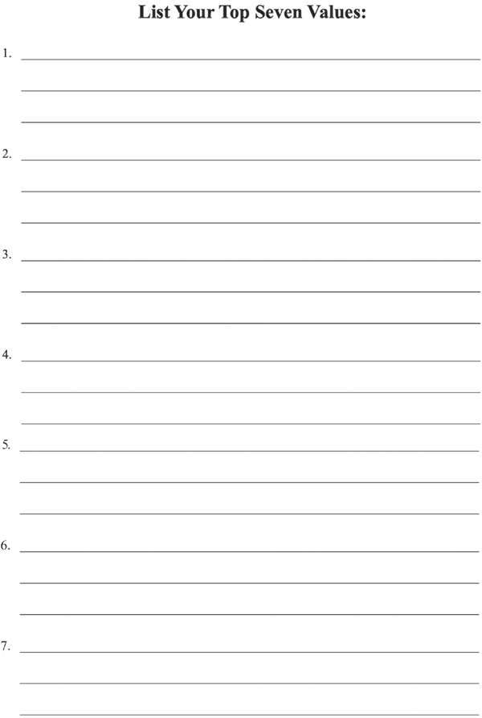

# 确定目标

领导之路需要明确的目标感

他只有 16 岁；他喜欢绘画和艺术，并渴望改变世界。他觉得自己有某种崇高的目标，一直在推动着他的整个年轻生活。随后，海外事件引起了他的注意。一场大战在欧洲爆发了，美国也在战斗。他感到有必要尽自己的一份力量，加入美国海军为他的国家服务。他辍学去了海军招聘人员。因未满17岁被征兵办公室拒绝，他自愿参加红十字会，成为一名救护车司机，并被“送到那里”。他在停战协定签署后不久抵达法国，但仍服役一年，为巴黎的一家后送医院驾驶补给卡车和救护车。在救护队的这段时间里，他的目标感是他的动力。沉浸在帮助伤员和振奋精神的精神中，他试图尽其所能带来喘息的机会，并在他的绘画和漫画中表达了这一点。他在救护车帆布两侧的内侧和外侧画了幽默的动物和图像。不开车的时候，他一直在画漫画。很快，异想天开的图像覆盖了他的救护车。他的一些作品非常受欢迎，以至于他的作品出现在《生活》杂志和红十字会报纸上。他相信他的目标是提升人们的精神并鼓励他们做梦。他明白他的“为什么”是为了帮助人们看清烦恼之外，寻找生活的美好。他相信：“如果我们有勇气去追求，我们所有的梦想都可以实现。”那个年轻人就是沃尔特迪斯尼，他在一战期间服役，后来创造了米老鼠、唐老鸭、高飞等许多令人难忘的人物和故事。作为领导者、远见卓识和爱国者，他还成为世界上最伟大的娱乐公司之一的创始人兼首席执行官。
找到你的为什么调用知道你的目标。两者不是同义词，而是密切相关。你的为什么是你存在的理由。你首先通过提出问题来确定你的核心价值观、你对什么充满热情以及什么赋予你意义。你的“为什么”不必是为了名誉或荣耀或拯救世界的宏伟而艰巨的努力。事实上，当我们从自己开始时，效果最好。这可能只是一种不试图比任何人更好的行为，而是每天努力成为更好的自己。你可以选择成为最好的自己，学习、成长并按照自己希望被记住的方式行事。抓住这个“为什么”，然后创造你的目标。

> 与目标保持一致
>
> 明确的目标使目标地形象化并定义成功。当你调整你的个人价值观、精神和目标时，你就有了专注。通过专注，你可以实现既定的目标并促使人们采取行动。

你的目标陈述会促使你采取行动并提供方向。目标是利用你的决心来实现你的愿景的能力。你可以激励人们共同努力实现一个目标，但只有当你知道自己要去哪里时，这种努力才重要。没有目标地的运动只是四处走动。例如，埃隆马斯克的目标是通过开发殖民火星的手段，使人类成为一个双行星物种。他非常专注于这个目标，并且正在与 SpaceX 一起采取重要步骤来实现这一目标。在马斯克的案例中，目标就是一切。目标是强大的，领导者对团队的价值取决于领导者的目标。有目标的领导意味着领导者拥有目标和目标，并将成功的参数转化为团队。明确的目标感对于成功的领导力是必不可少的。它不仅会帮助你成为更有效的领导者；它也可能引导你找到幸福。
目标是要超越自己。明确的目标感可以是一种激励和激励的力量。德国哲学家弗里德里希·尼采（Friedrich Nietzsche）曾经说过：“有原因的人可以忍受任何方式。”最近的哲学家约吉·贝拉 (Yogi Berra) 对目标也有很多话要说。 Yogi 是美国职业棒球接球手、球队经理和教练，以他的不当行为和精辟、自相矛盾的言论而闻名。你可能听说过这样的说法“直到它结束才结束”和“当你走到岔路口时，就走吧。”这些瑜伽教义看起来既矛盾又有趣，但其中蕴含着智慧，因为它们使你停下来思考。这些俏皮话的幽默是电动的，记者会尽最大努力成为第一个印刷或传播新瑜伽主义的人。关于了解你的目标，Yogi Berra 打出了一个本垒打：“如果你不知道要去哪里，你必须非常小心，因为你可能无法到达那里。”虽然很幽默，但这显然是真的。许多人在人生中没有课程。可视化目标地和设置路线是探路者如何找到道路。因此，如果你想到达目标地，那么了解你的目标至关重要。

> **思考的质量**
>
> “你生活的幸福取决于你思考的质量。”马可·奥勒留

你作为领导者的目标是什么？更深入地说，你的人生目标是什么？亚里士多德使用 telos 的概念来描述一个人的目标。 Telos 源自古希腊语（τέλος，意为“目标、目标或目标”），用于描述任何个人的目标和意图，以及指导他们的道德概念。如果你撒谎、欺骗和偷窃，你的领导会反映这一点，你会主要吸引骗子、骗子和小偷到你身边。如果你相信诚实、公平和工作所得，那么被你的领导所吸引的人通常会具有更积极的性格。亚里士多德将他对终极目标的关注集中在一个人的人生目标上。他相信我们每个人都有一个人生目标，而我们人生的重要任务就是理解、认识并实现这个目标。亚里士多德解释说，生活的目标是尘世的幸福，只有通过理性和美德的发展才能实现。
马库斯·奥勒留（Marcus Aurelius）将这种想法更进一步，他指出生命的目标就是责任。他相信每个人和每件事都有责任去履行。 “一切，一匹马，一棵葡萄树，都是为了某种使命而创造的，”马库斯在他的冥想中写道：“那么，你自己是为了什么任务而被创造的？一个人真正的乐趣在于做他为之而生的事。”他相信你可以控制自己的思想，因此，你选择要么控制要么失控，要么努力实现你的目标，要么浪费你出生时赋予你的存在的伟大礼物。马库斯坚信“生活的幸福取决于思想的质量。”如果这些想法是为了完成你的职责，马库斯会争辩说你过着高尚的生活。

> **有目标的生活**
>
> “人生的目标根本就不是要快乐。它是有用的，是光荣的。是要有同情心。重要的是，让它对你的生活产生一些影响。”里奥·罗斯滕

在 1960 年代，Leo C. Rosten 用一句经常被误认为是 19 世纪美国作家、诗人和哲学家拉尔夫·沃尔多·爱默生的名言来描述幸福的含义。罗斯滕说：

> 生活的目标不是要快乐——而是要有意义，要富有成效，要有用，要让你的生活有所不同。幸福，在古老的、高尚的意义上，意味着自我实现——它会给予那些充分利用上帝赋予他们的才能、运气或命运的人。对我来说，幸福在于将思想和心灵的资源延伸到我们所能达到的最远的边界。

与马库斯·奥勒留 (Marcus Aurelius) 一样，罗斯滕 (Rosten) 明白，生活的目标不在于享乐、放纵和娱乐的饱和。他会认为这样的生活是浪费和非常自私的。为一个比你自己更伟大的目标服务会带来更高的幸福。 Rosten 在《通识教育杂志》（第 17 卷，第 3 期，1965 年 10 月，第 169-78 页）上发表的一篇题为“我们赖以生存的神话”的文章中讨论了这个想法。在这篇文章中，他重申了他所看到的人生目标：

> 最后有一个让我最痛苦的神话：生命的目标是幸福，你应该玩得开心，你的孩子应该玩得开心。哪里写的生命如此廉价？哪里写到生活是，或者应该是，或者永远可以没有冲突、努力、剥夺和牺牲？ ……生活的目标根本不是快乐。它是有用的，是光荣的。是要有同情心。重要的是，让它对你的生活产生一些影响。

对于 Rosten 来说，如果你知道你的目标，并且每天都采取措施来实现这个目标，你就能找到幸福。
为了验证这个想法，想想你自己的生活。你知道你的为什么和你的目标吗？如果是这样，你的工作和日常活动是否会让你朝着目标前进，即使你每天只在实现目标（你的目标和意图以及指导它们的道德概念）的道路上迈出一小步？举个例子，想象一下你还没有找到你的为什么，也没有实现你的目标。你只是为了薪水而工作吗？想象一下，你正在从事一份你讨厌的工作，一份不符合你的原因或目标的工作，但你正在赚取薪水来维持生计。你对自己说你会换一份新工作，但那一天总是被推迟到未来。你觉得被困住了。为什么只为薪水工作如此不令人满意？成就感会影响你完成工作的动力。想象一下，相反，你正走在一条不同的道路上，你知道自己的原因，了解自己的目标，并且正在从事能够同时满足这两方面的职业。你想走哪条路？如果你不知道你的为什么和目标，你怎么知道这条路？
那么你如何才能真正理解你的目标呢？让我们进行一个简短的思想实验，其灵感来自于我对 Michael J. Gelb 的著作《如何像达芬奇一样思考》的研究。在本练习中，你将绘制一个简单的思维导图，以帮助说明揭示目标的方法。首先，你需要六支不同颜色的钢笔或铅笔。在接下来的几页中，你将完成各种任务，然后你将在第 52 页“我的思维导图”中汇总所有结果。
**第 1 步：创建自己的徽标**。你的标志是你是谁的视觉表现。在古代，这可能是你的个人纹章。就像徽章一样，它应该是你引以为豪的标志，代表你、你的价值观、你的目标和你的最高抱负。个人标志成为你的品牌，象征你是谁，它应该反映你的原因。花点时间思考一下，创造一个有意义的“你是谁”的象征。不用担心艺术天分的缺乏；你可以稍后改进徽标。

创建个人标志是自我意识的建设性练习。你的标志不一定是一件艺术品，也不应该像提供的例子一样，但它应该来自你的内心和头脑，本质上是感觉和思想的结合。提供示例徽标是为了给你一些想法。可以这样解释：人生和领导是一段旅程，你是一个探路者，以左边徒步的人为代表。从上到下，从左到右的符号可能表示：指南针（领导力）；沙漏（让每一刻都有意义）；书（终身学习）；明星（职责和目标）；在中心，一个心（爱）。你的标志应该是任何能激发你说：“这就是我”的东西。它可以是一个图像或多个图像，但应该是象征性的，而不是文字。我们的头脑在图片中思考。尽可能地视觉化。

> **价值观**
>
> 价值观有助于定义你的个人领导力，因为它们表达了你的独特性格。当你始终如一地遵循你的个人核心价值观，并且这些价值观与你的行为一致时，你就会更接近成就感。

**第 2 步**：列出你的价值观。你以什么价值观为生？价值观有助于定义你的个人领导力，因为它们表达了你的独特性格。当你的价值观与你的行为一致时，你就离成就更近了。价值观分为三大类：个人的、道德的和审美的。个人价值观是你为自己认可的价值观。道德价值观关乎对与错。审美价值用于对自然、品味和美进行分类。你的核心价值观是这三者的混合体，代表了你作为一个人的基本信念。换句话说，你的核心价值观定义了你的立场、你会为了什么而奋斗，以及你会为了什么而牺牲一切。了解你的核心价值观有助于你定义自己。查看目录中标题为“价值观清单”的词语，并圈出你认为代表你个人价值观的词语。
列出你的价值观很困难。尽管看起来很困难，但这值得你付出努力，并且是加强你对真实身份的了解的绝佳方式。抱有抱负并选择你想要拥有的价值观是可以的，但是通过识别并列出你所遵循的价值观，可以更好地了解“你是谁”。思考你圈出的价值观，然后选择你希望代表自己的前七名。选择前七名需要自我反省和反省。选择它们后，花点时间优先考虑对你最有意义的那些。例如，你的前七项核心价值观可能按优先顺序包括：勇气、领导力、诚实、勤奋、自由、韧性和学习。另一个例子可能是：信仰、家庭、幸福、谦逊、包容、养育和人际关系。比清单更重要的是，你能否阐明为什么这些是你的价值观，你如何践行这些价值观，以及为什么它们在你列出的优先事项中。在下一页上优先列出你的七个价值观。

**第三步**：列出你的人生目标。人生目标是长期目标。实现有价值的目标是成功的手段。目标是你提供方向的瞄准点，但只有当你采取行动养成实现这些目标的习惯时，它们才会成为现实。了解你的目标的一种方法是确定你的习惯。习惯是强大的。如果你的习惯支持实现你的目标，你将更有可能成功。习惯将好的或坏的做法放在自动驾驶仪上。养成良好的习惯是一个有价值的目标。如果你是一个习惯性吸烟者，但你的目标是戒烟，那么除非你改变习惯，否则你将失败。如果你想在财务上独立，请检查你的预算和投资习惯做法。如果你有成功的货币实践，你就可以预测实现你的财务目标需要多长时间。如果你不这样做，那么目标只是一个愿望，没有行动的愿望往往无法实现。查看你当前的习惯并调查你的行为是否有助于实现你的目标。如果他们不这样做，请养成积极的习惯。如果你想成为一个终身学习者，那么每个月阅读一本新书的纪律可以支持这个目标。例如，要实现这一目标，你需要养成的积极习惯是：“因为我是终身学习者，所以每个月都会读一本书。”了解习惯力量的一个很好的资源是 James Clear 的畅销书《原子习惯：建立良好习惯和打破坏习惯的简单而可靠的方法》（Avery，2018 年）。在这本书中，Clear“揭示了一些实用的策略，可以教会你如何养成好习惯、改掉坏习惯，并掌握导致显着结果的微小行为。” Clear 的主题是微小的变化，随着时间的推移而加强，会带来巨大的结果。因此，例如，如果你想开始阅读更多内容，只需每天阅读一页。最终，这会变成一种阅读习惯，成为一种可以改善你生活的学科。
写下你的人生目标是一项有用的练习。如果你从未列出人生目标，现在是开始的好时机。当你阐明你的人生目标时，你就为你想要的目标地设定了一条清晰的道路。罗马哲学家、政治家和剧作家 Lucius Annaeus Seneca 打趣道：“如果不知道自己正驶向哪个港口，则无风。”设定目标地是抓住生活中出现的机会（塞内卡对风的暗示）的最佳方式。 “设定目标，”作家兼励志演说家托尼罗宾斯说，“是将无形变为有形的第一步。”罗宾斯为有效的目标设定设定了四个秘诀：“1。请记住，追求与目标一样重要。 2. 设定目标并考虑到正确的范围。 3. 专注于你想要的，而不是你不想要的。 4. 实现目标后不要停下来。 5.不要担心没有实现你的目标。”除了这些建议之外，还要考虑 10 年后你想达到的目标，以及达到目标需要哪些目标。考虑这些目标的类别，例如家庭、职业、教育、精神、财务和健康。采取“全人”方法。例如，只列出财务目标，而忽略家庭和自我发展目标，可能会将你定义为一维人。花 10-15 分钟思考对你来说最重要的事情，然后开始写作。列出目标后，将最能满足你的目标和价值观的目标放在首位，然后是其他三个。在下一页列出你的四个目标。

考虑这些目标，然后根据你当前习惯的酸性测试来检查它们。思考你的目标是否与你的目标和价值观一致，问：“我的人生目标是否帮助我实现我的目标和表达我的价值观？”
**第 4 步**：了解你的优势。下一步是列出四个个人优势。这些是你的能力。能力可以是认知技能、处理思想的能力和基于知识的技能，即执行程序和任务所需的学习。例如，认知技能可能包括组织、计划、调节或谈判。这些技能通常涉及保持注意力、集中注意力、处理信息、识别模式或记住信息的卓越能力。基于知识的技能可能与工作相关，例如会计、木工、计算机科学、设计、工程、法律或销售。如果你将计算机技能列为强项，那么你应该知道如何使用最新的软件并不断保持熟练程度。如果解决问题是一种优势，那么你应该能够回忆起你最近解决的几个困难挑战。正如我们用习惯作为目标的酸性测试，你擅长的也应该反映在你积极的习惯上。如果你能确定你最强烈的积极习惯，这些应该与你的优势有关。由于习惯提供洞察力来帮助你确定目标是真实的，还是仅仅是一个愿望，习惯也是你个人优势的基石。仔细考虑一下，然后列出你的四大优势。

**第 5 步**：写下你的遗产。你的遗产是你希望被记住的简单陈述。花点时间思考你如何有所作为，计算你的祝福，并考虑你已经知道的在你的生活中令人难忘的事情，然后阐明你的遗产。你的遗产声明是你希望如何生活和被记住。它应该是对你最高肯定的声明。考虑你的遗产与你当前的年龄无关。明天是尚未收到的礼物。你送给别人最持久的礼物是什么？你可以将你的遗产声明视为送给你关心和关心你的人的礼物。你最重要的遗产不是你留下的东西，因为所有的东西都是短暂的，而是你的行为在其他人脑海中挥之不去的记忆。深入思考这一点，并且在最初编写时不要感到拘束。完成后，将你的想法减少到两三个简短的句子。

**第六步**：记录你的人生目标。最后，使用你的徽标、价值观、目标、优势和遗产作为参考，制作你的目标声明。这通常是完成个人思维导图最具挑战性的任务。写一篇描述你人生目标的简明陈述是了解你自己的关键一步。你认为你所做的每一件事都有一个目标，或者至少你应该做什么？现在是你找出答案的机会。将你的徽标、价值观、目标、优势和遗产视为你的宗旨陈述的基石。不知道自己的目标可能会导致不幸的后果。美国记者、畅销书作家、屡获殊荣的企业家和演说家 Rich Karlgaard 以这种方式解释了了解你的目标：“目标是一种柔软的美德——但它让你的脊椎变得坚强。”

> **挺直脊梁**
>
> “目标是一种软美德——但它让你的脊椎变得坚强。”里奇卡尔加德

目标是有方向的驱动。它可以帮助你前进并指向目标地。它给了你克服逆境的动力。如果你制定了明确的目标，那么你就会知道自己想去哪里，并且每天都可以采取措施向目标靠拢。朝着你的目标迈出的每一步，无论多小，都是一场胜利。目标给了你比你自己更伟大的东西。向外看自己将帮助你在多个维度上成长。目标明确会产生更大的影响。它可以让你进行更令人信服的交流。一旦你有了适合你自己的目标，你不仅有一个强大的工具来指导职业决策和成功生活，而且你还会增加获得幸福的机会。
要确定你的目标，请从提出正确的问题开始。什么让你快乐？什么为你提供了最具挑战性和吸引力的体验？你对什么充满热情，如此热情以至于你只专注于它而忘记了时间？是什么激励了你并让你为成就感到自豪？查看你的七个价值观，并思考它们与你的目标有何关联。你想完成的人生中的一项重大行动是什么？此时此刻，未来的自己会给你什么建议？想一想这些问题的答案，然后写一两句话来定义你的人生目标。不要想太多；尽快做，然后再修改。勇敢地攻击这个任务；看看你的发展，不要担心是完美的。去做就对了！你的目标会随着你不断反思而发展。
你的目标就是你的使命宣言。你为自己开发了它。不要担心或关心其他人会怎么想。使用主动语态：“我的目标是……”要有信念的勇气，用粗体字写下你的使命宣言。通常，你的第一个想法是正确的并且是正确的。集中你的想法并做出决定。写下你的目标陈述，阐明你想要完成什么和为之生活，并定义你是或想要成为的人。完成目标后，将其写在标题为“我的目标声明”的区域中。

**第 7 步**：创建你的个人思维导图。将你在步骤 1-6 中创建的信息转移到标题为“我的思维导图”的空白表格上。你的个人思维导图是一个及时的快照，它为你提供了一张关于你是谁、你想成为谁以及你想去哪里的图片。

大脑和学习方面的专家、100 多本书的作者和思维导图的发明者托尼·布赞将思维导图定义为：“[一种] 思维工具，可以从外部反映你头脑中发生的事情。思维导图就像是大脑的瑞士军刀。在思考、沉思、认知或记忆、创造方面我想做的任何事情，思维导图都是理想的工具……大脑通过想象和联想进行思考。”将你的目标、价值观、优势、目标和遗产联系起来，你创造了一个独特的形象化你是谁。要提高你对思维导图的理解，请查看 Buzan 的著作 Mind Map Mastery：The Complete Guide to Learning and Using the Most强大的思维工具（Watkins Publisher，2018 年）。创建个人思维导图是一项非凡的自我反省，也是帮助你成为更好领导者的宝贵工具。
在这个练习中，你已经想象了你的生活。在一页中，你总结了你是谁、你想成为谁以及你想去哪里。你的可视化越准确，此页面就越能代表你对自己的真实想法。你的基本思维导图是及时的快照，可帮助你提高自我意识，并使你更接近了解自己。现在你对自己或你是谁有了更好的了解，是时候将领导力模型形象化并学习如何利用这种自我知识成为更好的领导者。

## 章节总结

1. 领导之路需要明确的目标感。
2. 你的目标是将你的为什么付诸行动的陈述。目标是利用你的决心来实现你的愿景的能力。
3. 理解并找到你的目标是强大的。当你调整你的个人价值观、精神和目标时，你就可以专注于你的领导力。当你的领导力以明确的目标为指导时，你可以促使人们采取行动。
4. 为什么只为了薪水而工作如此不充实？成就感会影响你完成工作的动力。想象一下，相反，你正走在一条不同的道路上，你知道自己的原因，了解自己的目标，并且正在从事能够同时满足这两方面的职业。你想走哪条路？如果你不知道你的为什么和目标，你怎么知道这条路？
5. 可视化是一个强大的工具。可视化你的目标的一种方法是创建个人思维导图。该思维导图包括：
一个。创建你自己的个人徽标可帮助你在头脑中“看到”你的目标。
湾列出你的价值观。价值观有助于定义你的个人领导力，因为它们表达了你的独特性格。当你始终如一地遵循你的个人核心价值观，并且这些价值观与你的行为一致时，你就会更接近成就感。
C。列出你的人生目标。了解你的目标的一种方法是确定你的习惯。你习惯做什么，你就会变成什么。使习惯与目标保持一致是实现这些目标的一种手段。
d.列出你的长处。你擅长什么？
e.写下你的遗产。你希望被人记住什么？
6. 目标赋予你比你自己更重要的东西。向外看自己将帮助你在多个维度上成长。目标明确会产生更大的影响。它可以让你进行更令人信服的交流。
7. 你的个人思维导图是一个及时的快照，它为你提供了一张关于你是谁、你想成为谁以及你想去哪里的图片。这可以是一次非凡的自我反省，也是帮助你成为更好领导者的宝贵工具。

