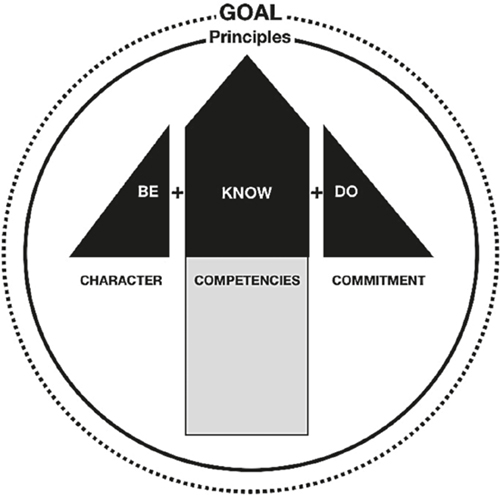
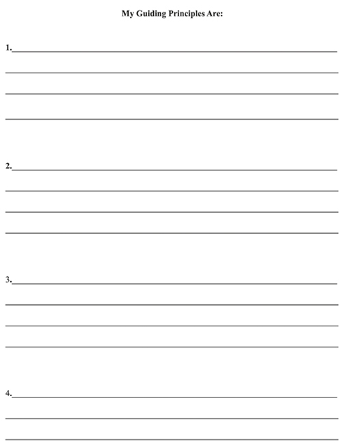
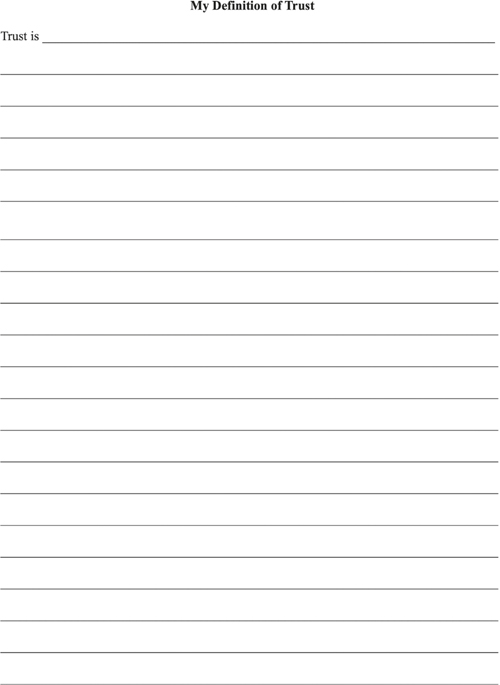
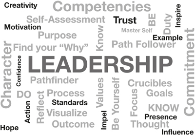

# 可视化你的领导力指南针

你能想象和相信的，你就能实现

他是一个浪人，一个 20 岁的武士，没有可以向他发誓效忠的领主或主人。他在 17 世纪的日本游荡着武士修行——武士的追求或朝圣。在旅途中，他在没有家人或学校保护的情况下练习和磨练了自己的剑术技能。这是一种非常危险的生活方式，很少有武士能够在没有宗族关系的情况下长期生存。没过多久，他就进入了一个城镇，并受到吉冈一族的挑战，要与一位名叫吉冈征十郎的战士进行决斗。由于浪人的年轻，吉冈认为他是一个容易的目标。比赛不是用锋利的武士刀，而是用木刀。决斗不是生死，而是一击决定。
两个武者面对面。吉冈是一位经验丰富的武士，比年轻的浪人年长得多，有望获胜。吉冈一开口，木剑呈攻击状伸出，一动不动。浪人也摆出同样的姿势，依旧一动不动。时间飞逝。两个人都没有动，但都保持着他们的姿势，专注地互相注视着。一阵微风吹过。吉冈转眼一毫秒，一时分心。年轻的浪人以鹰的迅捷猛扑过去。他的攻击精准，一瞬间，决斗就结束了。浪人的木剑折断了吉冈的手臂，一击取胜。吉冈被羞辱了，他退隐了，放下了剑，成为了和尚。
宫本武藏是这个故事中的年轻浪人，他成为了日本最伟大的剑客。他由禅宗僧侣抚养长大，受训成为武术以及生活的精神和道德层面的专家。随着他的学习，他既是一个受过教育的人，又是一个令人敬畏的战士。他是领导力、哲学、战术和战略的经典著作《五环之书》（维克多·哈里斯 [译者]，格拉梅西出版社，1988 年 5 月 28 日 [1643 年首次出版]）的作者。 Musashi 的人生故事是关于自我掌控、专注和可视化的非凡传奇。 13岁那年，他赢得了自己的第一场决斗，成为了一名剑客。他从未输过决斗，在60多次胜利后，他成为日本的传奇人物。他是一个高度专注的人，他将自己的动作想象得如此完美，而且动作如此迅速，以至于思想和行动之间似乎没有任何差距。以思想的速度移动是武藏掌握的强大技能。在另一场他最著名的决斗中，他与一位名叫小次郎的持剑武士对决，他只用一把木桨就击败了熟练的对手。

> **宫本武藏的教训**
>
> “除了你自己，没有任何东西能让你变得更好、更强壮、更富有、更快或更聪明。一切都在里面。一切都存在。
> 在自己之外别无所求。”

武藏不仅仅是一名战士，他在决斗中赢得了与剑士一样的专注和策略。他一生都专注于自我完善和个人成长。他是一位深刻的思想家，一位诗人和一位水墨画（禅宗水墨画）艺术家。这种艺术天赋可能是他视觉化能力的关键。他认为，要真正理解领导力和战略的艺术，必须在各种艺术中磨练自己的技能，而且必须在头脑中看到它。 “磨练你的智慧：学习公义，区分善恶，一一研究不同的艺术之道，”武藏建议。 “道”指的是武士的道德价值观，强调忠诚、诚恳、节俭、武术和荣誉至死。 “当你不被男人欺骗时，你就会意识到战略的智慧。”公元 1645 年左右，在他去世前不久，他将自己的教义记录在五本书中，其中四本书以四个要素之一命名：地球（领导知识和行动训练）；水（战略知识、态度和哲学的流畅思考）；火（战斗方法和技巧的知识，以采取果断行动）；和风（了解他的周围环境和他的对手正确行动的策略）。他的第五本书，名为《虚空》，讲述的是心灵和感知难以理解的事物，根据适当的原则执行每一个行动。每本书虽然侧重于剑术和战争，但也是对领导力和人类哲学的研究。
领导者需要品格来处理压力、不确定性和冲突的矛盾；掌握专业能力的纪律和培训；并承诺坚持到底，并尽一切努力保持光荣和正确。 Musashi 的主题是领导者必须做好准备、感知、专注和行动。 Musashi 相信你的内在性格、能力和承诺会驱使你取得成功。缺乏这些品质会妨碍你获胜的能力。这三个类别中的每一个都可能导致你失败。时至今日，领袖们都在研究武藏的著作，他的教义对日本文化产生了巨大的影响。
武藏的关键教训不是剑术，而是领导力。武藏相信通过一套简单的原则生活才能达到精通。他不相信通往成功的捷径。他提到的最重要的教训是，领导者从习惯性学习中受益；明确的重点；可视化的能力；以及克服逆境的内在力量和纪律。武藏写道：“这把长剑乍一看似乎又重又笨重，但当你第一次拿起它时，一切都是这样。”学习成为更好的领导者就是这样。没有简单的道路。
要成为探路者并了解道路，领导者应该致力于可视化。心理意象可以提高任何技能的表现。可视化包括思考实现目标的步骤的能力，拒绝出现在你意识中的失败的负面形象，并为总会出现的挑战做好计划。如果你能在脑海中看到你的目标并想象实现它的步骤，那么你离实现这个目标越来越近了。这些心理锻炼可以帮助你提高认知能力。聚焦成像会激活你大脑中许多相同的神经网络，从而能够完成实际任务。现代最成功的高尔夫球手之一杰克·尼克劳斯（Jack Nicklaus）说，每次击球之前，他都会在脑海中练习。武藏在每次决斗中都进行了类似的心理想象。在你的脑海中看到目标会让你倾向于实现那个目标。这种形象化对于领导他人的人来说至关重要。圣经箴言 29 说“没有异象，民就灭亡”，领导任何团队都是如此。想象路径和目标地所需的精神能量是成功的重要促进因素。想象挑战，在脑海中描绘出解决方案，在尝试性的讨论中看到自己冷静和专注，可以让你为真正的遭遇做好准备。我们希望我们的领导者看到可能性并为我们做好准备，这就是为什么能够计划的领导者对任何组织都如此重要。正如拿破仑希尔所说：“头脑可以想象和相信什么，它就可以实现。”
可视化不仅仅是做白日梦；这是有目标的白日梦。它是行动的先导。领导者思考、想象然后采取行动。就像武藏以思想的速度用剑行事的能力一样，一个可以预见目标地并传达清晰而简单的愿景以便其他人可以看到路径的领导者已经表现出强大的影响力。专注的可视化是一种心理排练。训练你的头脑专注于你的目标，然后看到自己完成它。本质上，我们就是我们所想的，因此使用这个工具来理解、概念化和成长。 “在有效的个人领导力中，”领导力和时间管理专家史蒂文·柯维博士说，“形象化和肯定技巧是从经过深思熟虑的目标和原则的基础上自然产生的，这些目标和原则成为一个人生活的中心。”美国著名数学家约翰·图基 (John Tukey, 1915–2000) 开发了大量数学算法和科学进步，协助设计了 U-2 侦察机，并创造了计算机术语“bit”，使用可视化来查看别人做不到的。图基教授说：“一张照片的最大价值在于它迫使我们注意到我们从未预料到会看到的东西。”
在你旅程的这一点上，你已经了解了解自己和明确目标的重要性。正如在第 1 章和第 2 章中所讨论的，你已经通过创建个人思维导图（简化的“思维图”）来形象化你的目标。如果你现在可以设想一张领导力图片，这张图片可以作为你旅程中的另一个集结点。你能想象你领导力的组成部分吗？当你观想时，你在脑海中创造了你想要达到的目标，将不可见的（思想）转化为可见的（行动）。畅销书作家兼著名领导力教练罗宾·夏尔马 (Robin Sharma) 在谈到可视化时说：“一切都被创造了两次，首先是在头脑中，然后是在现实中。”
可视化领导力模型可以帮助任何人成为更好的领导者，并且是调节你的思想和心灵以按照思想的速度对任何情况做出正确反应的基础。要做到这一点，领导者必须知道他们的目标。领导者要求具有处理冲突的压力、不确定性和矛盾的性格；掌握其专业能力的纪律和培训；以及坚持不懈并尽一切努力实现未来愿景的光荣和正确承诺。武藏写道，可视化和“感知肉眼看不到的东西”的能力是领导者最伟大的技能之一。正如通向知识的道路有很多，或者正如武藏所说的“到达山顶的方法有很多”一样，有很多形象可以描述领导力。
为了传达你的领导力愿景，你应该能够在你的脑海中看到它，就像武藏可以想象他的剑的打击一样。标题为“你的领导力指南针”的图表提供了领导力可视化的示例。例如，指南针是探路者必不可少的工具，它提供了一个有用的类比，可以向他人解释你的领导力故事。拥有一个生动的领导形象将帮助你创建一个清晰的心理图景，然后可以成为你现实的一部分。你的领导力指南针是领导力主要组成部分的心理形象。花时间研究这个插图，然后我们将探索它的每个组成部分。

> **可视化**
>
> 当你观想时，你在脑海中创造了你想要达到的目标，将不可见的（思想）转化为可见的（行动）。可视化领导力模型可以帮助任何人成为更好的领导者，并且是调节你的思想和心灵以按照思想的速度对任何情况做出正确反应的基础。

## 你的领导指南针

你的领导力指南针是你领导力的可视化。
你的目标就是你的目标。
你的原则是你赖以生存的首要理想。领导力的三个主要组成部分是：
性格（BE），
能力（知道）和承诺（做）。当你的目标与你的原则和指南针一致时，你的领导才能处于最佳状态。

## 你的近期目标

领导者的目标是实现目标。无法实现目标的领导者不会长期领导。你的目标可以是自己指定的，也可以是别人指定的。设定实现目标的路径。可视化将你的团队带到所需目标地所需的步骤。领导力教练兼作家约翰麦克斯韦将目标与成功之间的关系解释为：“你的梦想决定了你的目标。你的目标勾勒出你的行动。你的行动创造结果。结果为你带来成功。”他认为目标必须是个人的才能有效。如果你的目标符合你的个人原则和价值观，你就会在危机时刻毫不犹豫。当你将目标与指南针的其余部分保持一致时，你的领导才能最有效。如果你的目标与你的原则、性格、能力和承诺不同，你就会错位并危及实现你的目标。

## 原则

在第 2 章中，你创建了一个思维导图，其中涉及发现你的目标、价值观、优势、目标和遗产。现在你必须更进一步，思考你的指导原则。按照设计，指南针指针指向北方。箭头指向 true，你可以自信地朝任何方向移动。原理类似。如果你知道什么原则指导你，那么你就知道什么时候在正确或错误的方向上旅行。 Merriam-Webster 词典将原则定义为综合性和基本的法律、学说或假设。它也被定义为一个基本真理或命题，作为信念、行为或推理链系统的基础。原则可帮助你确定真正的北方并指导你的领导之旅。了解自己的原则是了解自己并始终努力做自己的另一种有效方式。如果你调整你的目标和原则，那么这种融合可以引导你成为一个更加一致和引人注目标领导者。
在他的著作《高效能人士的 7 个习惯》（自由出版社，1989 年）中，斯蒂芬·柯维博士将原则定义为“像重力一样的自然法则。它不同于一个值。价值观是主观的；原则是客观的。重力……如果你掉下什么东西，重力就会控制。”柯维使用收获法则来解释原则如何支配你的生活和你所做的一切。在农场，你很快就会知道播种什么就会收获什么。如果你播种小麦，你可能会种植小麦，但前提是你要努力浇水、除草和培育作物。生活就是这样。你将收获你所播种的。想种花花园但不喜欢园艺？如果你将时间、才能和精力投入到生产中，那么无视你的花园将产生一张满是枯死病植物的床。一直忽视你的健康，你就会有医疗问题。想写一本书吗？每天写一页，一年后，你可能有一本小说的基础。每月定期花掉你所有的收入，不存任何储蓄，最终你将没有积蓄。开车时在手机上发短信，很可能会发生事故。读书、学习、提升思维；或者只看电视和上网，看着你的思绪萎靡不振。现在的准备和学习，加上正确的培育，才能成长为智慧。丰收法则是不变的、不变的、不变的。它不在乎你。这是不公平的，没有同理心，而且是无情的。这是生活的一个原则：控制投入，你就会改善获得积极结果的前景。如果你有远大的梦想并努力工作，你就有机会实现你的愿望，但这需要始终如一的、专注的努力。小的行动，比如迈出第一步，可以随着时间的推移变成更大的回报，让你到达目标地，但前提是你继续走下去。

> **收获法则**
>
> 在农场，你很快就会知道播种什么就会收获什么。如果你播种小麦，你可能会种植小麦，但前提是你要努力浇水、除草和培育作物。生活就是这样。

根据柯维的观点，原则是自然法则。自然法则是基本真理。他们是绝对的。它们是因果关系。如果你违反了自然法则，比如万有引力定律，它会伤害你，除非你打算带着降落伞跳下悬崖并在适当的时候拉开开伞索。光明与黑暗、水与火、生与死都是我们生活在其中且无法改变的绝对的例子。今天，我们不喜欢从绝对的角度思考，但它们是一成不变的。我们认为我们的技术可以改变这一切，把黑夜变成光明，把热变成冷，把疾病变成健康，但最终，自然法则胜出。学会处理生活的自然规律是成为成年人的本质。
那么，领导力的自然法则是什么？如果原则是自然规律和不言而喻的，那么指导我们领导的原则是什么？柯维引用了领导力的四个自然法则，据他说，这些法则超越了文化和时间。它们是安全、引导、智慧和力量。安全感是我们的价值感、感情、身份、个人力量和自尊。指引是你人生的方向，是你人生的方向。智慧是知识和经验的融合。权力是决定、行动和坚持完成某事的能力。根据 Covey 的说法，如果你理解了这四项原则，你就可以将它们转化为一个强大的指南针，让你走上正确的道路，继续你的领导之旅。

> **领导原则**
>
> 领导原则是你的指导规则或行为准则。

Ray Dalio 是一位成功的投资者，同时也是畅销书《原则》（Simon & Schuster，2017 年）的作者，他说他的人生三大原则是：“自己思考决定 1）你想要什么，2）什么是是的，以及 3) 根据 #2，你应该做什么才能实现 #1，并以谦逊和开放的态度做到这一点，以便你考虑可用的最佳想法。”他说，我们每个人都必须确定自己的原则，从我们的人生旅程和我们经历的每一段领导力中学习。
在当今世界，按原则生活似乎已经过时了。例如，许多大学宣布的原则仅仅是行为准则。有一些例外。在美国西点军校，他们向学员教授三项一般原则，这些原则将指导毕业生的一生：责任、荣誉和国家。道格拉斯麦克阿瑟将军在 1962 年在西点军校的著名演讲中解释了这些原则的影响。

> 这三个神圣的词虔诚地规定了你应该成为什么，你可以成为什么，你将成为什么。他们是你的集结点，在勇气似乎失败时建立勇气，在似乎没有理由相信的时候重拾信心，在希望变得渺茫时创造希望......对为了人类的进步而颁布的任何伦理或哲学的测试。它的要求是对的事情，它的约束来自错误的事情。

职责是你负责的工作。荣誉是做正确事情的信念，即使没有人在看。国家是捍卫美利坚共和国的无私服务的概念，以至于你将牺牲自己的生命来捍卫它。这可能对参加西点军校的士兵有用，任何人都可以从这些原则中学到很多东西，但它们对其他人是否有价值？我们能否通过了解武藏、科维、达利欧和西点军校等不同来源，以某种方式制定一份领导原则清单？
作为一个基本真理，领导原则不仅是价值清单，还必须是你的指导规则或行为准则。大多数人没有可以表达的原则，突出了他们的想法是模糊的，在决定的那一刻，没有指南针引导他们，他们可能会误入歧途，选择更容易的错误而不是更难的正确.原则坚定的人，会在关键时刻正确行事，不会偏离正确的道路。花时间了解你的原则，指导你生活的基本真理，是一项值得的事业。

> **最重要的自由**
>
> 生活中最重要的自由是自己思考和决定的能力。

如果我们看看 Musashi 的原则，就会发现时间价值的首要主题，包括以思想的速度行动的能力，以及认识到每个人都是凡人，因此只有有限的时间来成长、学习、并充分发挥他或她的潜力。柯维的综合理念是知识和经验的价值，然后将其转化为智慧。达里奥的综合理念是让个人去思考和选择。他将这种选择表示为最大的美德。西点军校的职责、荣誉和国家是一套永恒的原则，指导军事领导人维护自由政府的价值观。
生活中最重要的自由是自己思考和决定的能力。你生命中最大的挑战和礼物是采用你自己的一套可以成为你的“北极星”的原则。如果你的目标和原则不一致，那么你的言行之间的不一致最终会被你领导的人发现。你会被视为一个相信一件事但做一些完全不同的事情的领导者。
考虑以下个人原则作为示例，可以帮助你创建自己的列表。这些原则最好放在一个句子中，表达价值的意图并将其与行动联系起来。想象一下这些原则以及它们将如何指导你的生活。

1. 爱人如爱：爱需要你有同理心和同情心，超越自己的思维，站在别人的立场上，了解你的行为将如何影响他人和你领导的团队。这个原则的例子概括了我们希望别人对我们做什么的“黄金法则”。
2. 我以德为生，以服务为先：美德召唤你做正确的事情，倾听你的良心和内心的声音，告诉你对与错的区别。你可以把自我放在服务之前，或者把服务放在自我之前来领导。你更愿意追随哪种领导者？以这种态度生活并将服务置于自我之前可以成为影响人们的有力榜样。
3. 我寻求智慧，知识与经验的结合，我是终身学习者：如果你集中时间和精力去获取知识和经验，并反思它们如何融合创造智慧，你可以在你的领导下帮助自己和他人小路。
4. 我珍惜每一刻，想充分利用有限的时间我必须有所作为：时间提醒你，时钟总是在滴答作响，生命短暂，我们都应该充分利用每一个宝贵的时刻.苹果公司的天才开发者兼联合创始人史蒂夫乔布斯曾经说过：“我生命中最喜欢的东西不花钱。很明显，我们所有人拥有的最宝贵的资源就是时间。”

编写原则清单在哲学中并不是白费力气。想一想列出指导原则后你将体验到的见解。如果你实践你的原则，并以此为生，它们将有助于形成习惯，成为你未来的脚手架。这个想法体现在播种和收获的格言中。拉尔夫·沃尔多·爱默生 (Ralph Waldo Emerson) 曾说过：“播种行动，收获习惯。播下一种习惯，收获一种性格。播种一种性格，收获一种命运。”如果你想收获命运并创造未来，请选择将指导你在生活中行动的原则。自己思考和决定。原则不仅仅是“灰尘和空气”；当你必须在对与错之间、在你的个人利益与更大利益的利益之间进行平衡时，它们可以是指导你行动的方位角。如果你的原则是合理的，它们就会成为指南针，为你指明正确的方向，指导你的决策。不要担心你没有受过哲学教育。古罗马伟大的皇帝兼哲学家马库斯·奥勒留 (Marcus Aurelius) 是这样说的：“没有哪个角色像你现在所担任的角色一样适合哲学。”

> **收获命运**
>
> 如果你想收获命运，请选择将指导你在生活中行动的原则。

你的指导性领导原则是什么？把它们写下来，在下一页，并包括一个简短的单行解释它们对你的意义。最初，不要试图完美地表达它们。如果你闭上眼睛，集中注意力，并深入思考应该指导你生活的原则，这些话就会显现出来。

## 特点

研究标有“你的领导力指南针”的图表，并想象使你的领导力“走上正轨”的指针由三个部分组成：性格、能力和承诺。性格、能力和承诺的相互作用，当与原则保持一致时，就会保持你的前进方向。性格使言行合乎原则。品格是你声誉的基石，也是你领导力的基础。牛津词典将性格定义为个人特有的心理和道德品质。这是一种始终知道并做正确事情的能力。模范品格是诚实、做正确的事情即使困难重重、关注共同利益、信守诺言和赢得信任。性格很重要。马丁·路德·金牧师恳求我们不要“根据肤色，而是根据性格的内容”来判断一个人。他知道性格是决定性的属性。

> **性格内容**
>
> “我期待有一天人们不再以肤色来评判，而是以性格的内容来评判。”马丁路德金。

作者 Chris Brady 和 Orrin Woodward 在他们的畅销书《发起领导力革命，掌握影响的五个层次》（Business Plus，2007 年）中写道：“缺乏品格的人不会以有意义的方式取得成功……品格包括诚实、正直、勇气、基于绝对真理、信仰、谦虚精神、对他人的耐心、纪律和自我控制的权力价值观。”操纵者可能会成功一段时间，但最终没有品格的领导者只会播下悲伤。品格包括成为一名优秀的追随者，并理解亚里士多德对他的年轻学生亚历山大的名言：领导者必须学会服从才能领导，必须学会服从才能指挥。
对品格的一个很好的考验是观察人们在认为某人没有权力或地位时如何对待他人。 Pauline Esther “Popo” Phillips 于 1950 年代开始了著名的“亲爱的艾比”专栏，在印刷品和广播中发表了著名的评论：“一个人性格的最佳指标是他如何对待对他没有任何好处的人，以及他如何对待无法反击的人。”美国第 16 任总统亚伯拉罕·林肯透露了他对品格的考验，他宣称：“几乎所有男人都能忍受逆境，但如果你想考验一个人的品格，就给他权力。”你的性格建立了你的声誉。声誉就像一个银行账户，而人品则是日后可以用利息还清的日常投资。虽然名誉可以被炒作，但品格是用行动来观察和建立的。林肯敏锐地表达了品格和声誉之间的区别，他说：“品格如树，声誉如影。影子就是我们的想法；这棵树是真的。”作为真实的东西，性格可以激发信心并建立信任。信任常常成为减少执行任何具有挑战性的任务或项目时出现的摩擦的“石油”。

> **模范人物**
>
> 性格是个体特有的精神和道德品质。这是一种始终知道并做正确事情的能力。模范品格是诚实、做正确的事情即使困难重重、关注共同利益、信守诺言和赢得信任。

信任是所有领导者都想要和需要的东西。每个人都渴望被信任，但你知道什么是信任吗？如果你想赢得那些追随你的人的信任，就需要一个明确的定义。你对信任的定义是什么？考虑一下并在下一页写下你对信任的定义。

你对信任的定义必须是你所相信的。我将信任定义为所观察到的一致、连续和连贯的行动。言语等于行动。不是你说了什么，而是你说了什么，然后你做了什么，才能产生信任。如果你告诉我你每天早上 8 点 30 分在办公室，但一直在早上 9 点以后逛逛，那你的言行就会发生冲突。当你告诉我你会在办公室时，无论是在上午 8:30 还是任何其他时间，我都不会相信你会在办公室。信任就是说你的意思并做你所说的。如果你说谎、欺骗和偷窃，任何人都不可能信任你，你将获得品德低下的名声。如果你始终如一、连续且连贯地按照你所说的去做，人们就会学会信任你。

> **信任库**
>
> 性格是积极价值观的组合，成为你信任的宝库。

性格是积极价值观的组合，成为你信任的宝库。在沙漠风暴行动中成功领导美国武装部队并负责赢得伊拉克战争的战略的美国将军诺曼·施瓦茨科普夫将军认为，品格是领导力的最重要因素。 “领导力是战略和性格的有力结合，”施瓦茨科普夫宣称。 “但如果你必须没有一个，那就没有策略。”因此，良好的道德品质是你领导力的重要元素。打个比方，每次你采取正确的行动时，你都会将存款存入你的信托账户。即使没有人在看，做正确的事也会增加你的信心并增强你的性格。每次你不负责任地行事时，你都会撤回。最终，如果你提款过多，你的角色就会破产。性格无可替代。一旦你以不可容忍的行为毁了你的性格，玷污了你的名誉，几乎不可能恢复。回想一下你在电视上读到、在电视上看过或在互联网上了解的富人和名人，他们因可耻的行为而名誉扫地。大多数人认为他们是如此出名或如此强大，以至于性格规则不适用于他们。很可能，他们没有一套明确的原则来指导他们，他们也不明白他们的性格是他们最宝贵的资产。
美国陆军有句谚语：“军官总是在阅兵式”。这意味着士兵会不断观察领导者，无论是在上班还是下班。同样，在各行各业，你的团队成员都会观察你作为领导者所做的一切。他们听到你说的一切。你的言行举足轻重。如果你认为轻微的违规行为可以逃脱惩罚，请再猜一次。当你违反规则时，总会有人发现它，当一个人知道时，最终每个人都会发现。领导者总是在游行，受到他们领导的人的观察和判断。你的性格成为你的盔甲，保护你免受消极思想和行为的伤害。这是关于做正确的事情，尤其是当你认为没有人在看的时候。你必须采取行动来发展自己的性格，并考虑将积极的改进作为存款到你的性格帐户中。

## 能力
在领导他人之前，你必须先发展自己。没有实际的专业知识，你真的能知道自己在做什么吗？熟练度很重要。没有人愿意跟随一位无能的领导者。每个领导角色都有不同的要求，但都需要具备领导能力和技术技能。如果你不能自己完成工作，你如何执行标准？如果你没有能力完成你的核心任务，你的员工就会因为你缺乏知识而感到沮丧。没有比无法完成你期望其他人完成的工作更快地失去团队尊重的方法了。如果人们认为你无法胜任你期望他们执行的任务，他们将很快对你的领导力失去信心。要胜任，你应该具备成功执行分配的任务和任务所需的能力、知识和技能。如果你不知道如何做你指示别人做的工作，你就是一个失败的领导者和一个伪君子。花时间学习。列出领导团队必须学习的基本技能。如果你希望人们跟随你，你必须有能力。
为了发挥最大潜力，你需要具备完成工作所需的技能——不仅要领导团队，还要树立榜样并表明你可以胜任这项工作。你必须能够胜任团队成员的基本技能，才能教导他人。教学是领导力的一个重要方面，因为领导者的主要职责之一是培养下一代领导者。有效的领导者能够胜任人际交往能力和技术任务。在军队中，这被称为“技术和战术上的精通”。如果你可以按照既定标准执行工作，则你在技术上是精通的。精通战术意味着你知道何时以及如何使用这些技能来完成任务。没有这些技能，你将无法获得团队成员的信任、信心和忠诚。对于一线领导，所需的技能涉及你要求他人做的工作。对于战略领导者来说，这些技能涉及决策、规划和沟通等更高层次的能力。未能掌握你特定领导级别的基本技能，你很快就会失去追随你的人的信心和信心。如果你不了解业务，就很难带领别人成功。如果所有的领导都以身作则，那就表明你能胜任这项工作，你将赢得团队的尊重。

> **称职**
>
> 要胜任，发展能力、知识和技能，以成功完成分配的任务和任务。如果你不能做你让别人做的事，你就是一个失败的领导者和一个伪君子。

每位领导者都需要具备一般领导技能，这些技能侧重于激励、沟通、计划、批判性思维、解决问题、分配任务和教学等人文方面。其中，通过口头和书面语言进行交流是一项主要的领导技能。沟通是所有人际关系的关键。如果你不能沟通，你就无法领导。你越擅长沟通，你成功的机会就越大。通信包括接收和发送。要成为有效的沟通者，领导者从倾听（接收）中获益比从说话（传递）中获益更多。 “多听少说”对任何人来说都是有用的格言，尤其是新的和缺乏经验的领导者。
如果没有一些技术专长就无法有效领导，那么领导者必须寻求每一个成长和学习的机会。在当今技术加速发展的时代，在技术任务中胜任并保持最新状态对于了解背景和深度以准备做出及时准确的决策至关重要。没有人愿意跟随无法决定或始终做出错误决定的人。你不必成为所有方面的专家，但如果你不能胜任这项工作，请找人教你并获得熟练程度，这将提高你的能力并激励你的团队成员。为了胜任他们的技术任务，新的领导者必须投入时间和精力来改进并最终展示他们工作的基本能力。这是通过首先了解你必须具备哪些技能，然后努力掌握它们来实现的。发展你的能力将增强你的自信心，增加你的影响力并增强你的信誉。寻求对团队有益的自我提升将获得团队成员的尊重。继承武藏的座右铭：“今天是战胜昨天的自己；明天就是你对小人的胜利。”成为终身领导者，学会精通战术和技术，你的团队成员将跟随你，因为你将成为他们的探路者。

> **技术能力**
>
> 每个领导者都需要能够证明他们能够胜任工作的技术技能。你不必成为所有方面的专家，但如果你不能胜任这项工作，请找人教你并获得熟练程度，这将提高你的能力并激励你的团队成员。

一个关于能力重要性的小故事：在我作为美国陆军军官的第一次任务中，我被分配到位于德国弗里德伯格的第 32 装甲团第 3 营。这是冷战的高峰期。到目前为止，我在陆军的经历包括在美国西点军校、空降和游骑兵学校接受了四年的教育和培训，以及在肯塔基州诺克斯堡接受了为期四个月的坦克排长培训课程。我已经做好了准备，就像任何一个浑身湿透的第二中尉一样，渴望领导我的第一个排的挑战。我知道我不精通坦克指挥官所需的任务，因为我没有经过足够长的训练来获得任何程度的精通。第一天，我的高级领导，连长告诉我，他打算指派我领导第 3 坦克排。然而，他有所保留，因为目前负责的排中士不希望为他的排分配一名军官。排中士拉里·斯蒂普 (Larry Stipe) 觉得自己作为“代理排长”做得很好，他不喜欢训练一个全新的 2 中尉的苦差事。排中士斯蒂普带领第三排的五辆坦克已经有将近一年的时间了，没有一个军官负责。连长接着告诉我，斯蒂普以严肃的坦克中士、专业的坦克士兵和杰出的领导者而著称。我告诉连长，我理解挑战，我会努力做到的。他微笑着指派我担任第三排的排长。
第二天，我遇到了我的排中士。我在机动水池里发现了斯蒂普，排的士兵正在努力维护他们的坦克。斯蒂普穿着绿色的机械工作服，浑身泥土和油脂。我永远不会忘记第一次见面。作为排长，我的工作是领导排，但在这里我遇到了一位经验丰富的士官，他已经成功地做到了这一点一年多。我意识到他不需要我。如果我要成功，我就必须向他展示我可以如何加入团队。我把手伸给他说：“排中士，我被指派为第三排的排长。我不太了解坦克或领导坦克排。如果你教我，我保证会倾听和学习。”当我伸出手站在他面前时，斯蒂普注视了我很长时间。其余士兵停下工作，看着，好奇这次遭遇会如何。

> **个人和团队领导水平**
>
> 有经验的领导者知道，仅仅提高个人技能是不够的。伟大的领导者也能提升团队水平。

终于，斯蒂普笑了笑：“好的，先生，我一直在等你这样的中尉。你想学，我教你。”他握了握我的手，并指示我穿着机修工的工作服回到摩托池报到。接下来的三个星期，我在斯蒂普的注视下服从并“上学”。他教会了我更多关于坦克、领导力和成为排长的知识，这超出了我的想象。我学会了永远不要低估专家讲师的价值。导师是无价的。直到今天，我认为那次经历是我学到的关于学习和领导价值的最重要的一课。优秀的领导者善于教授和提高个人和团队的技能水平。杰出的领导者，例如排中士拉里·斯蒂普，也是出色的教练，并且知道如何领导和影响他们的领导者。我可能有等级和权威，但斯蒂普是专家。他领导并训练我。我们达成协议，由我领导排，但他负责日常运营。这种关系使我们的排在维修准备水平、坦克炮兵和战术方面成为该营中最好的排之一。领导力与等级或权威无关，而与影响力有关。斯蒂普是一位领导者和老师。我做过的最明智的举动是承认我缺乏经验并争取他的支持来教我。直到今天，我有幸在我职业生涯的早期就发现了这一点，这让我感到惊讶。

> **训练井**
>
> 海豹突击队向古希腊哲学家 Archilochus（公元前 680-645 年）致敬，他们说：
> “当你处于压力之下时，你不会迎难而上，你会陷入训练的水平。”

有经验的领导者知道，仅仅提高个人技能是不够的。优秀的领导者也能提升团队水平。正如个人可以提高他们的技能水平一样，每个团队都有领导者必须理解、提高和培养的领导力和技能水平。领导者通过深思熟虑和有针对性的教学（提供强化知识的理论）、培训（成功地执行任务）、辅导（个性化和定制的一对一基于绩效的教学）和指导（基于关系的教育）来做到这一点。有经验的领导）。 Archilochus 是一位受人尊敬的著名希腊诗人战士，他在战斗之间创作诗歌，被古希腊人尊为最杰出的作家之一，生活在公元前 680 年至 645 年，他说：“我们没有上升到这个水平在我们的期望中，我们下降到了我们的训练水平。”花时间训练你的团队达到高水平的表现，他们可以超出预期。将培训重点放在团队的工作上，而不是个人技能上。作为例外，与其抱怨没有时间或金钱进行培训，不如想办法做到这一点。挑战你的团队并设定高标准。如果输入影响输出，那么你对团队的投资就会产生回报。对我来说，排中士拉里·斯蒂普是我的 Archilochus，他花时间训练我并通过提高我的技术和战术熟练程度来提高我的领导水平。

## 承诺
承诺是致力于一项事业或活动的愿望和热情。领导者对坚持和实现目标的承诺程度可以激励其他人采取同样程度的奉献精神。相反，一个缺乏承诺的领导者会激发团队中的冷漠。没有承诺，你很少开始，也永远不会完成。没有承诺，小障碍就会显得很大，你就无法克服阻碍你前进的障碍。
探路者必须有强烈的承诺感，才能进入未知领域。在家里保持安全，或者沿着别人的道路走，而不是在未知领域开辟新的道路更容易。想象一下宇航员尼尔·阿姆斯特朗、迈克尔·柯林斯和埃德温·“巴兹”·奥尔德林成为阿波罗 11 号任务的一部分并成为第一批登陆月球的人类所付出的个人承诺。这三个是美国能生产的最好的宇航员。他们是品格出众的人。他们具有非凡的能力，并在危险和紧张的情况和训练中反复测试。 1968 年 5 月 6 日，在休斯顿载人航天器中心 (MSC) 附近的艾灵顿空军基地，阿姆斯特朗正在进行登月研究飞行器的训练飞行，这是一种用于模拟登月舱的飞机。当阿姆斯特朗因系统故障而失去所有控制时，他将飞机驾驶到高空。测试车辆的仪表没有提供任何未决故障的警告。然后，车辆突然起火。当测试月球着陆器冲向地面时，阿姆斯特朗只有几秒钟的时间来决定要做什么。就在着陆器坠毁并爆炸成一团火球之前，他迫不及待地弹射到离地面 200 英尺的地方。坠机调查发现，氦气压力泄漏导致姿态推进器出现故障。如果这发生在月球上，着陆器上的每个人都会被杀死。这次近距离通话证明了阿姆斯壮在决策和能力方面的卓越表现。阿波罗 11 号的机组人员已经准备就绪，但正如登月舱事故所表明的那样，风险很大。以前没有人这样做过。承诺是决定性的。如果没有机组人员、美国国家航空航天局 (NASA) 的整个团队以及美国政治领导人的承诺，要完成任务并成为第一个登上月球的人，银河不会把他们带到那里。
不畏挫折，让人类登上月球的承诺坚定不移。阿波罗 11 号任务始于 1969 年 7 月 16 日从美国宇航局肯尼迪航天中心的 39A 发射场发射的巨大土星五号火箭的完美发射，将三名宇航员送上月球。在他们的电视机上，美国和全世界人民都敬畏地看着机组人员将视频更新传回地球。四天的旅行终于让阿姆斯特朗、奥尔德林和柯林斯登上了月球。他们的火箭飞船由一个“指挥舱”和一个“登月舱”系统组合而成。 7 月 20 日，阿姆斯特朗和奥尔德林现在在登月舱内，代号为“鹰”号，与月球轨道飞行器分离，发动火箭发动机，向粉白色的月球表面加速。柯林斯独自在代号为哥伦比亚的指挥舱中等待，并与鹰号和美国宇航局位于德克萨斯州休斯顿的任务控制总部保持无线电通信。每个人似乎都屏住了呼吸，祈祷一切顺利。

> **承诺**
>
> 承诺是致力于一项事业或活动的愿望和热情。
> 这是你对目标的热情和投入程度。
> 没有承诺，你很少开始，也永远不会完成。

登月舱的下降按计划进行，但当“鹰”接近指定着陆区时，导航计算机系统出现错误代码。当这个警报在小屏幕上闪烁时，人们只能想象阿姆斯特朗的脑海里在想什么。就在一年前，他在试图登陆模拟登月舱的类似情况中差点丧生。然而这一次，却是逃不掉了。他和奥尔德林无法从登月舱中弹射出来，而且，也没有弹射的地方。他们需要老鹰才能生存。阿姆斯特朗不得不迅速做出决定。
阿姆斯特朗通过无线电向任务控制中心发送了信号。休斯顿告诉他，美国宇航局的专家认为故障是电路过载导致的错误。没有时间去验证他们的预感是否正确。中止或继续的最终决定完全取决于登月舱指挥官阿姆斯特朗。阿姆斯特朗决定继续执行任务，奥尔德林完全同意。飞船的着陆系统设置为自动驾驶，将登月舱带到着陆地点，月球上被称为“宁静之海”的部分，但从飞船的小窗户向外看，阿姆斯特朗可以看到大块的巨石覆盖了计划的着陆区域。如果登月舱撞到其中一块巨石，它可能会折断着陆腿，任务将以灾难告终，两名美国宇航员丧生，或者如果他们幸存下来，则滞留在月球上，直到氧气耗尽。已经没有营救的可能，也没有第二次机会。阿姆斯特朗知道登月舱有足够的燃料降落在地面上，几乎没有多余的燃料可以进行额外的机动。他检查了燃油表，看着奥尔德林，然后做出了决定。一个不太忠诚的领导者可能会中止任务，但阿姆斯特朗不会。他接管了控制权，断开了自动着陆系统，并手动操纵鹰绕过巨石到达安全着陆点。下午 3 点 17 分美国东部时间 1969 年 7 月 20 日，鹰号在宁静海安全着陆。阿姆斯特朗随后向美国宇航局发送了现在著名的传输：“休斯顿，鹰已经着陆。”
想象一下，如果你必须做出 Neil Armstrong、Buzz Aldrin 和 Michael Collins 在 1969 年 7 月阿波罗 11 号登月任务期间面临的决定。将美国宇航员带到月球的技术尚处于萌芽阶段。指挥舱和登月舱的计算能力只有2K，比我们今天的音乐贺卡还少。查看登月舱的模型，它具有锡罐的外观，带有一些电子设备、一个火箭发动机和四个支腿。登月舱的外部壁板在许多地方都是薄如纸的。阿波罗任务最重要的力量在于领导者和团队的人力，而不是他们操作的设备。阿姆斯特朗、奥尔德林和柯林斯，以及返回地球的整个 NASA 团队，都具备完成工作的品格、能力和承诺。整个团队坚定不移的奉献精神至关重要，尤其是阿姆斯壮在决定性时刻的承诺。因此，承诺是关于行动的。这就是说和做的区别。如果没有对成功的坚定承诺，阿波罗 11 号的机组人员将永远不会是第一个登上月球并安全返回地球的人。
在阿波罗 11 号的故事中，参与和承诺之间的区别是主要的，而且非常清楚。参与意味着你有兴趣，但没有完全投入。你本质上是一个“游客”，不对成功或失败负责。当你承诺时，你就是探路者，为成功和失败承担责任。你不再只是感兴趣；你致力于完成使命。亚伯拉罕林肯说：“承诺是将承诺变为现实的原因。”承诺需要个人投资并强烈认同原因。约翰亚当斯是一位重要的爱国者，美国独立战争期间美国自由的拥护者和美国第二任总统，在给妻子阿比盖尔的一封信中说：“地球上只有两种有价值的生物：那些有承诺的人，以及那些需要他人承诺的人。”亚当斯后来在大陆会议前的讲话中说：“生或死；下沉或游泳；生存或灭亡；我承诺遵守《独立宣言》。我已承诺，如果上帝愿意，我愿意为这个国家的自由而死。”亚当斯清楚地理解，更重要的是，他活出了参与和承诺之间的区别。

> **参与和承诺的区别**
>
> 参与意味着你有兴趣，但没有完全投入。你本质上是一个“游客”，不对成功或失败负责。当你承诺时，你就是探路者，为成功和失败承担责任。你不再只是感兴趣；你致力于完成使命。

问问自己这个问题：“为什么会有人关注我？”反思到目前为止你所学到的知识，你可以开始回答这个重要问题。首先，你正在学习了解自己，这是提高领导意识的第一步。其次，你已经探索了你的目标，这表明你已经决定了一个方向。第三，你可以想象一个描述你的原则、性格、能力和承诺的领导模型，并且可以在你的脑海中看到这个模型。这是一种强大的思想融合。领导力是困难的，但我们可以学习和提高我们的技能。 “一开始可能看起来很困难，”武藏警告我们，“但一开始一切都很困难。”掌握了这些知识，在下一章中，你将制定个人对领导力的定义。

## 章节总结

1. 目标可以是暂时的，但原则是永恒的。生活中最重要的自由是自己思考和决定的能力。你在生活中的重大挑战和礼物是采用你自己的一套可以成为你的“北极星”的原则。
2. 当你调整你的目标和原则时，你会成为一个更加一致和引人注目标领导者。
3. 品格、能力和承诺：领导者要求品格能够处理冲突的压力、不确定性和矛盾；学习其专业能力的纪律和培训；以及坚持不懈并尽一切努力实现未来愿景的光荣和正确承诺。
4. 品格：品格是“个体特有的精神和道德品质”。这是一种始终知道并做正确事情的能力。
5. 能力：每位领导者都需要能够证明他们能够胜任工作的技术技能。掌握特定的专业技能是领导力的基础。
6. 承诺：承诺是你完成任务并承担成功和失败责任的能力。承诺帮助你开始、坚持和完成。
7. 可视化是一项重要的领导能力。可视化包括思考实现目标的步骤的能力，拒绝出现在意识中的失败的负面形象，并为总会出现的挑战提前计划。

