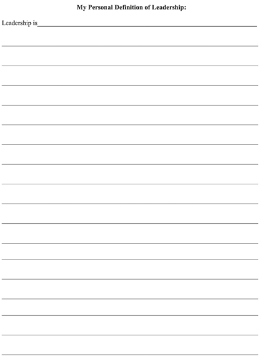
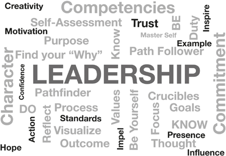

# 领导力的个人定义

一切理解始于定义

真正的领导者是罕见的。赫拉克利特是一位古希腊哲学家，他出生于以弗所城，在苏格拉底时代之前就实践过哲学，他理解战斗中领导力的非凡本质：“每 100 个人中，十个甚至不应该在那里，80 个是只是目标，九个才是真正的战士，我们很幸运拥有他们，因为他们做出了战斗。啊，不过那一个，一个是武者，他会把其他的都带回来。”
你怎样才能学会释放你的潜力并成为一个有效的，甚至是非凡的领导者？老板有几十个，经理和主管有很多，但真正的领导者很少。许多人认为领导力包括无法复制的无形品质。因此，大多数组织默认创建和发展经理。管理人员遵循流程并可以将流程传授给他人。这种默认设置的一个原因是领导力很难定义，也更难培养。自文明开始以来，人们一直在研究和教授领导力。领导力是一门艺术，而不是一门科学，因此它无视简单的解释或定义。作为一门艺术，领导力对每个人都是独一无二的；没有针对所有人的单一的、编纂的定义。
然而，我们可以在个人层面上定义领导力。非凡的领导者对领导力制定了个人定义，然后按照他们的定义生活。他们之所以非凡，是因为他们花时间研究领导力并了解艺术的动态。他们对领导力的个人定义成为他们独特的承诺和肯定，这是他们学会遵守的规则。亚里士多德在其题为《尼各马可伦理学》(Nicomachean Ethics) 的著作中，将领导力描述为普遍和不变的人类美德与随情况而变化的人类行为之间的动态比较。亚里士多德认为，领导者必须了解领导原则才能成为有效的领导者，然后将其应用于不断变化的领导环境。为此，新兴领导者必须接受广泛的培训和教育。

> **唯一的那个**
>
> 老板有几十个，经理和主管有很多，但真正的领导者很少。非凡的领导者对领导力制定了个人定义，然后按照他们的定义生活。

在 David L. Cawthon 的一篇优秀文章“亚里士多德论领导力”（圣克罗伊评论。2001 年）中，作者指出：“毫无疑问，亚里士多德的哲学见解对我们目前对领导力的理解产生了相当大的影响。在所有从希腊历史的黄金时代出现的哲学家中，与苏格拉底和柏拉图一起，他是对我们对领导力的理解的形成最有影响力的人之一。”亚里士多德认为领导力的根源是精神（价值观）、感伤（人类情感）和逻各斯（理性和逻辑），而经验很重要。他著名地告诉他的学生，一位年轻的马其顿王子，除非他学会了跟随，否则他永远不会学习领导。亚里士多德表达了这样一种信念，即优秀追随者的品质实际上是为优秀领导做好准备。作为他的学生亚历山大，亚里士多德的教义一定产生了影响，因为他从希腊北部的土地上崛起，成为他那个时代最伟大帝国的领袖。
亚历山大大帝在管理其庞大帝国方面所体现的领导力与我们任何人都会经历的情况大不相同，但所有领导者都将面临他们自己的当代领导力挑战。领导力依赖于环境并随着条件的变化而变化。随着你在领导力方面的成长，以及承担越来越多的责任和复杂性角色，你的领导环境会有所不同。如果你以同样的方式领导，在任何情况下，你都会把艺术误认为科学。只应用一种方法或领导原则是不会成功的。巧妙的领导者知道没有“唯一的方法”可以领导；没有静态的领导情况。领导力在人、情感、行动和机会的动态流动中展开——时间总是在滴答作响。领导者必须仔细了解和调查情况。正如探路者在踏上旅程之前研究领土的沟壑、丘陵和河流一样，成功的领导者在行动之前会先了解人类的地形。领导者必须考虑人们的目标、价值观、情绪以及团队内部的权力关系。正如武藏所指出的，有很多方法可以到达山顶。领导者必须仔细审查多条路径，并选择最能以最少的资源成本实现团队目标的路径。大多数领导者没有花时间对他们的人力资产进行这种分析。

> **人类地形**
>
> 作为一个探路者，在踏上征途之前研究一个领土的沟壑、丘陵和河流，一个成功的领导者在行动之前先读过人类的地形。

自赫拉克利特 (Heraclitus) 时代以来，哲学家和教师一直无法确定有效领导行为的单一定义。这是应该的。领导力没有简单的秘诀。领导力是多方面和复杂的，但当领导者的性格、能力和承诺协调一致时，才可以实现。创建你自己的领导力个人定义会增强这种和谐。别人的定义不应该是你个人的定义。快速回顾一下领导力的几种定义可能会激发并帮助你发展自己的领导力定义。
领导力就是行动：领导者使事情发生。领导力是让团队完成工作并实现目标。作家兼领导力专家彼得·德鲁克 (Peter Drucker) 认为：“领导力是由结果而不是属性来定义的。”领导力是行动的最高形式，因为它可以调动团队的力量来完成比任何个人单独做的更多的事情。关于领导力的一个巨大误解是，领导力是关于职位的。在 20 世纪电视形成时期担任西屋广播公司董事长的唐纳德·麦克甘农 (Donald McGannon) 说：“领导力是一种行动，而不是一种职位。”在一个既有利可图又受欢迎的时代，麦甘农率先将香烟广告从电视上撤下。他明白行动胜于雄辩，并相信电视有社会责任追求亚里士多德认为的美德。 McGannon 在卷烟广告方面的领导地位以及他在媒体中关于社会责任的领导地位，被认为有助于遏制香烟成瘾。

> **行动**
>
> “领导力是一种行动，而不是一种职位。”
> 唐纳德·麦加农

领导力就是目标：领导者利用团队成员不断发展的热情来实现目标。领导者察看形势，学习路径，并有远见，可以计划、准备和行动，以推动团队抓住机遇并实现目标。成功的领导者学会感知团队不断发展的热情，并将这种精神用于目标。美国作家、励志演说家、企业培训师、企业家和心灵鸡汤系列的合著者杰克坎菲尔德说：“如果你能调整你的目标并真正与它保持一致，那么设定目标，使你的愿景成为现实。表达那个目标，那么生活就会更容易流动。”托马斯·卡莱尔 (Thomas Carlyle) 是 19 世纪英国历史学家和作家，曾撰写过有关领导者和领导力的文章，他有句名言：“没有目标的人就像没有舵的船。”你应该问的问题是：“我的船有舵吗？”如果你的目标是登陆月球，那么尽一切努力登陆月球。在没有目标精神的地方，成功的领导者会产生目标精神。

> **目标**
>
> “没有目标的人，就像没有舵的船。”
> 托马斯·卡莱尔

**领导力就是动力**：领导者激励员工和团队采取行动。动机是指导持续努力以实现目标的能力。激励型领导者激励和引导人们实现目标。西奥多·罗斯福 (Theodore Roosevelt) 通过提醒人们“相信你能做到，你就成功了一半”来激励周围的人。动机需要通过言行进行交流的能力。能够推动人们超越自己的想象，并作为一个团队一起工作的领导者，拥有强大的能力。为此，最好的领导者知道是什么激励了他们领导的人。这不是一项简单的任务，因为人类很复杂，但它始于领导者倾听和学习的能力。亚历山大大帝在 30 岁时创建了古代世界最大的帝国之一，他激励他领导的人说：“凡是愿意尝试的人，没有什么不可能”，然后以身作则，让看似不可能的事情变成现实发生。

> **动机**
>
> “最伟大的领导者不一定是做最伟大事情的人。他是让人们做最伟大事情的人。”
> 罗纳德·里根总统

如果领导者可以了解团队的动机，那么领导者就可以解决团队成员的愿望和需求。团队成员的个人动机将推动他们的个人行动。如果领导者能够将这些动机联合起来为实现团队目标而努力，那么领导者就会增加团队成功的可能性。作为卓越的领导者和沟通者的罗纳德·里根总统认为：“最伟大的领导者不一定是做最伟大事情的人。他是让人们做最伟大事情的人。”
**领导力就是信任**：信任是所有领导力的基石。信任就是精神上的加入。领导者需要追随者，否则他们只是管理者。作家、演说家和超级成功的企业家 Seth Godin 是这样说的：“赢得信任，赢得信任，赢得信任。那么剩下的你就可以操心了。” Stephen Covey 博士写道：“信任是人类动机的最高形式，因为它可以激发人们的最佳潜能。”在他的著作《信任的速度：改变一切的一件事》（西蒙和舒斯特，2006 年）中，柯维将信任定义为信心。 “与（信心）——不信任——相反的是怀疑。”有一个老生常谈，只需要一个谎言就可以让你成为骗子或不信任对你撒谎的人，诚实可能并不总是值得的，但说谎总是要付出代价的。因此，赢得信任是对领导力的一项重要投资，每个领导者都必须了解这一点。如果领导者胆怯、不诚实或不可靠，团队将反映这些失败。如果领导者勇敢、诚实、可靠，那么领导者更容易获得团队的信任，团队更能体现领导者的特点。为了赢得团队的信任，作为领导者，你必须说你的意思，做你所说的，然后以身作则。领导者知道赢得信任，赢得尊重，欣赏诚实，回报忠诚。这些陈述经常被引用为吸引力法则的例子：你吸引你关注的东西。出于我们的目标，我们将信任定义为“通过观察到的一致、连续和连贯的行动证明的信心”。信任不是信仰，是没有证据的信仰，而是观察和承认的行动。因此，必须赢得信任，不能购买或胁迫。以信任的速度领导并加速你的团队。

> **信任**
>
> 要赢得团队作为领导者的信任，你必须说出你的意思，做你所说的，然后以身作则。领导者知道赢得信任，赢得尊重，欣赏诚实，回报忠诚。

**领导力就是希望**：拿破仑·波拿巴 (Napoleon Bonaparte) 从 1799 年到 1815 年统治法国并带领他的军队进行了绝望的战斗，他激励人们追随他近 20 年。拿破仑有句名言：“领袖是有希望的商人。”拿破仑知道人们必须相信领导者会带领他们通过挑战取得成功。他明白领导者从绝望中带来希望。每个团队都会面临挑战。希望是相信事情会按照承诺发生的。希望是一种期望的飞跃，可以激发团队成员的想象力以实现目标。希望是一种激励的承诺。虚假的希望是虚假的承诺。领导者在承诺时必须诚实和清醒。希望始于愿景，而不是目标，并专注于“为什么”和“如何做”。领导者灌输对成功的充满希望的愿景，并解释如何实现这种成功，障碍可以而且将会被克服。一个能够产生希望的领导者带领团队穿越荒野，走上每个人都可以想象的道路，最终到达他们想要的目标地。

> **希望**
>
> 希望是相信事情会按照承诺发生的。希望是一种期望的飞跃，可以激发团队成员的想象力以实现目标。希望是一种激励的承诺。

**领导力就是**以身作则****：美国陆军游骑兵队的座右铭是“游骑兵带路！”这句格言承认所有的领导都是以身作则。领导者必须言出必行，言出必行。不这样做将导致你的团队成员失去信任和信心。根据 20 世纪作家、哲学家和博学者阿尔伯特·施韦策 (Albert Schweitzer) 的说法，“领导人们的三种最重要的方式是：……以身作则……以身作则……以身作则。”为了获胜，领导者必须激励和推动队友采取行动。为此，领导者必须以身作则，言传身教。在这两者中，例子是最强大的。丰富多彩的演讲对电影院来说可能很棒，激动人心的推文可能会激起一些人的情绪，但在现实世界中，领导者主要以身作则。 “跟我来”并随后与你的团队一起前进比“继续，我不去，你去做”和安全地留在后面具有更大的影响力。请记住，领导者总是在游行，你团队的每个成员都会倾听你的每一句话并观察你的所有行动。你领导的人会立即知道你是否以身作则。
示例（行动）每次都胜过承诺（承诺稍后做某事）。 “以身作则不是影响他人的主要手段，”科学家、理论物理学家、哲学家和天才爱因斯坦说，“这是唯一的手段。”所有的领导都是以身作则。乔治·华盛顿将军在担任战争与和平领导人的职责期间践行了这一座右铭。在美国独立战争期间，华盛顿是美国军队的总司令。在与英国的八年战争中，从 1775 年到 1783 年，华盛顿将军从未离开过军队。他从未离开军队，而是留在他的手下，即使在最糟糕的时候，以身作则。他在前线领导，无数次冒着生命危险。尽管在战斗中许多士兵倒在了他的身边，但华盛顿从不退缩，也没有以身作则。尽管子弹在几次战斗中刺穿了他的帽子和衣服，但他仍然无所畏惧。华盛顿了解成为陆军和国家榜样的力量，成为其他领导人效仿的标准。华盛顿有领导才能。他的士兵忠于他，由于他树立的榜样，他们开始致力于美国的自由事业。没有乔治华盛顿就没有美利坚合众国。他的领导力就是那么重要。如果你想知道是什么让乔治·华盛顿在长期艰苦的独立斗争中成为胜利者，并为他赢得了“国父”的美誉，可以概括为四个字：他以身作则。

> **以身作则**
>
> “三种最重要的领导方式是：……以身作则……以身作则……以身作则。”阿尔伯特·施魏策尔

**领导力就是影响力**：领导力不是权威、职位或等级。领导力是关于影响其他人的能力。影响力是一个人的力量，它是一种对他人的行为和性格产生影响的强制力量。任何渴望鼓励和帮助他人的人都可以产生积极的影响。影响力不需要等级、头衔、职位或权力。世界历史上最有效的领导人没有等级。耶稣基督和孔子在无数代中影响了数十亿人，但他们没有官方的权威或头衔。 Simon Sinek 写道：“领导力是一种选择，而不是等级。组织中的任何人都可以成为领导者……它选择关注你左边的人，并关注你右边的人。” Joseph C. Rost 在他的开创性著作《21 世纪的领导力》（Praeger，1993 年）中指出：“领导力是领导者和追随者之间的一种影响关系，他们打算真正改变以反映他们的共同目标。”领导力利用影响力，而管理层则强加权威。管理和领导的根本区别在于，领导需要下属，而管理需要下属。因此，领导力是领导者和团队之间动态的、相互影响的过程。约翰·麦克斯韦 (John Maxwell) 表达了同样的想法，他说：“领导力就是影响力，不多也不少。”

> **影响力**
>
> 任何愿意鼓励和帮助他人的人都可以产生积极的影响力。影响力不需要等级、头衔、职位或权力。

马库斯·奥勒留 (Marcus Aurelius) 说：“不要再浪费时间争论什么是好人了。成为一个。”因此，不要再浪费时间争论一个好的领导者应该是什么，成为一个。首先制定你自己对领导力的个人定义，将你的领导风格品牌化，让所有人都知道。领导者必须沟通。对于你所领导的人来说，了解领导力是什么并且能够清楚、简单和简洁地向他们表达是很重要的。如果你专注于对领导力的一个措辞周到的个人定义，你很容易提高理解如何领导的能力。你的定义可以帮助你在自己的脑海中想象出更清晰的领导力形象。 “领导力是学来的、赢得的和辨别出来的，”作家兼牧师里克·沃伦 (Rick Warren) 说。 “你开发它。它基于信任和可信度。别人在你身上看到了。你不能要求它。”

> **你对领导力的定义**
>
> 领导者必须沟通。对于你领导的人来说，重要的是你知道领导力是什么，并且你可以清楚、简单和简洁地向他们表达……你的定义可以帮助你在自己的脑海中形象化更清晰的领导力形象。

如果正如苏格拉底所说，所有理解都始于定义，那么你对领导力的个人定义可以为你的领导方式设定标准。随着你获得经验，修改和锐化你的定义。我见过的大多数领导人，在军队、商界和政府部门，从来没有花时间为领导力制定个人定义。你应该是个例外。想想看。你个人对领导力的定义是什么？不要复制别人的定义。想象一下，向你领导的人解释这个定义，并将其用作提高团队成员领导意识的集结点。在下一页上，用 1-5 句话写下你对领导力的个人定义。小心构建它，仔细选择每个单词。在制定你的定义时同时使用专注和热情。尝试在脑海中想象它并在心中感受它。使用主动语态，第一人称，这样你对领导力的个人定义就这样开始：领导力是……。

你刚刚在领导力之旅中又迈出了关键的一步。除非你先用自己的话来陈述，否则你无法真正理解某事。如果你可以定义它，你就可以对其进行可视化、测量和改进。如前所述，伟大的古希腊哲学家苏格拉底说：“所有的理解都始于定义。”如果你想了解领导力，你对领导力的个人定义必须描述你想如何领导。如果你领导的人问你：“什么是领导力？”你回答“我不确定。我从来没有真正考虑过，”这有多鼓舞人心？
你对领导力的定义提供了衡量你作为领导者行为的个人标准。愤世嫉俗或含糊其辞的定义，例如“领导者就是领导者所做的事情”，并没有多大帮助。创建和完善你的定义，就好像你想说服某人相信、信任和跟随你一样，好像一切都取决于此。定义完成后，对其进行测试。让某人扮演魔鬼的代言人和“红队”你的定义。红队包括像对手一样思考，严格挑战想法、计划和假设。与尽可能多的值得信赖的人讨论你的个人定义，让他们充当你的红队。聆听、暂停并反思他们的反应和评论。如果你发现在这个交互过程中你的定义有不足，那就调整它。发誓不断审查和改进你的定义，以确保它是你所相信的标准。你对领导力的个人定义必须成为你个人品牌的重要组成部分。
我通过向父母学习、在学校、体育、在美国军队的 30 年、在商业和自学中学习，形成了我对领导力的定义。我个人对领导力的定义是：“领导力是影响力的艺术和神圣的信任。它是促使人们作为一个团队一起工作以完成任务的能力。领导力需要不断发展领导者的性格、能力和对成功的承诺。领导力是一个旅程，而不是一个目标地。”
对我来说，领导力显然是影响力的艺术。要影响，你必须启发或推动，避免诉诸“强迫”，除非别无选择且在极端情况下。我相信领导力是一种神圣的信任。至少，作为领导者，我要对你的时间负责，而时间就是生命的本质。浪费时间就是浪费生命。因此，如果你在我的团队中，我将竭尽全力不让你失望。这是我对队友的承诺，我认为能够努力遵守承诺是我的荣幸。
在生活中，我们都会提升到我们的领导水平。如果你的领导水平很高，你就能产生非凡的、积极的影响。如果你的领导水平低，你的生活就会很困难；你与他人合作的能力将受到限制，并且将事情变得更好的能力也会减弱。在涉及两个或更多人的任何情况下，领导力都很重要。每个领导人都掌握着他们所领导的人民的命运。对于军队、警察、消防员和急救人员来说，领导者的角色实际上意味着生与死的区别。在其他职业中，领导者控制着团队成员的工作时间。时间构成了生活质量，如果被糟糕的领导所浪费，就会造成浪费、滥用和失败。出于这个原因，我认为领导力是一种神圣的信任，因为它涉及到人。在你的团队中，没有比你领导的人更宝贵的资源了。
在任何团队中，领导者都会决定成败、胜利或失败。有效的领导可以产生协同作用，并创建可以超越其各部分总和的团队。他们放大了团队中的人，以创造比单独工作时个人所能拥有的更大的影响力。
成为领导者可能是一项挑战，但这种经历会带来内在的回报。带领团队渡过困难和失望可以考验你的韧性和承诺。克服挫折以建立和领导一支成功的团队可能是一种激动人心的经历。学习领导，并且领导得很好，会让人非常有成就感。如果你不断通过学习提高你的领导意识，并不断寻求机会获得领导经验，你的领导能力就会提高。归根结底，理解领导力本质上是一次了解自己的旅程。自我意识是关键。没有比释放你影响、激励、激励和有效引导人们取得成功的能力更大的回报了。
在当今竞争激烈、不断变化和过度活跃的商业世界中，获胜的公司和团队是那些员工最熟练、最专注和最热衷于完成使命的公司和团队，无论是将新产品推向市场还是提供世界一流的服务。这些成功的公司和团队的主要共同点是杰出的领导者；领导者在一生的旅程中掌握影响人们取得成功并使事情变得比以前更好的技能。更新一下我在本章开头引用的赫拉克利特：“在为组织工作的每 100 名员工中，有 10 人甚至不应该在这里，80 人只是循序渐进，做最低限度的工作，9 人是熟练的主管和经理，我们很幸运有他们，因为他们让组织保持运转。啊，但是一个，一个是真正的领导者，一个具有推动每个人共同努力并实现目标所需的品格、能力和承诺的探路者。”下一章，我们将用这种精神来确定你个人的“超能力”。

## 章节总结

1. 管理人员几十，主管多，真正的领导少。非凡的领导者花时间为领导力制定个人定义，然后按照该定义生活。
2. 作为探路者，在踏上征途之前，研究一个领地的沟壑、丘陵和河流；一个成功的领导者在采取行动之前会先了解人类的地形。
3. 领导力没有简单的秘诀。领导力是多方面和复杂的，但当领导者的性格、能力和承诺协调一致时，才可以实现。创建你自己的领导力个人定义会增强这种和谐。
4. 领导者必须沟通。对于你所领导的人来说，了解领导力是什么并且能够清楚、简单和简洁地向他们表达是很重要的。你的定义可以帮助你在自己的脑海中想象出更清晰的领导力形象。
5. 如果所有理解都始于定义，那么你对领导力的个人定义可以为你的领导方式设定标准。
6. 当你获得领导者的经验时，从该经验中学习以修改和提高你的定义。
7. 每个领导者都应该对领导力有自己的定义，并在他们的领导力之旅中继续发展这个定义。作者对领导的个人定义是：“领导是影响的艺术和神圣的信任。它是一种能够促使人们作为一个团队一起工作以完成任务的能力。”领导力需要不断发展领导者的性格、能力和对成功的承诺。领导力是一个旅程，而不是一个目标地。

