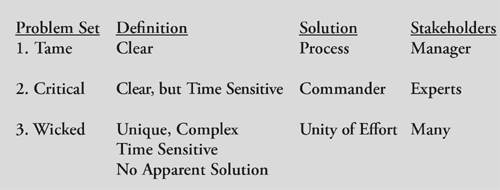
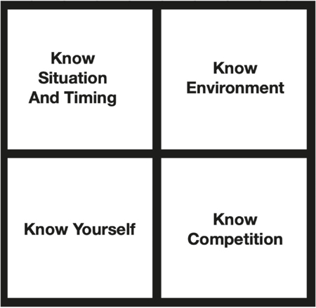
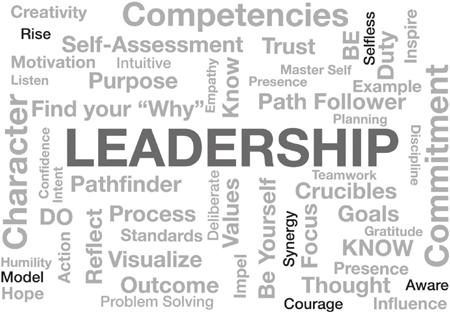

# 通过学习如何决定来塑造你的命运

领导者必须制定计划并做出决定

一场大雨像暴风雨中的狂风一样袭击了萨福克宫的屋顶和窗户。空气潮湿而粘稠，充满期待。主要决策者坐在设施齐全的庄园的一张长桌旁，庄园是盟军远征军最高司令部 (SHAEF) 的临时总部。大部分将领的心情都阴沉了下来。盟军的计划是复杂、详细和精密的。为了这一天，团队已经工作了一年多，现在恶劣的天气注定要毁掉这个计划。坐在桌头的男人深深吸了一口烟。这几天他抽烟太多，睡得很少。他已经 53 岁了，但大多数人都觉得他看起来老了很多。他现在没有时间考虑自己。他的重点是天气。
集结的小组即将做出的决定是历史上最大的两栖入侵的时机。五月的天气晴朗，法国大部分海岸的天空都晴朗，但部队还没有做好准备。六月的天气变得很糟糕。每天都下雨。他已经推迟了一次入侵。最初计划在 6 月 5 日发布，6 月 4 日发布的天气预报是如此糟糕，以至于每个高级参谋人员都同意将入侵推迟 24 小时，以期希望天气好转。事实证明，6 月 5 日的天气预报是准确的，几乎不可能出现天气。海面波涛汹涌，许多盟军船只因害怕被淹没而不得不寻找安全的港口。战争的时机就是一切，一切都归结为这一刻和一位领导人的决定。
盟军最高指挥官德怀特·戴维·艾森豪威尔将军又吸了一口半燃烧的香烟，然后把它扔在烟灰缸里，仿佛要压碎一个黑暗的念头。他召集了他的指挥官来听取最新的天气报告。他的决定将决定数千名士兵的命运，而且很可能会决定战争的结果。桌旁的几位高级将领想知道艾森豪威尔是否能胜任这项任务。前一天，艾森豪威尔向流亡法国自由军领导人戴高乐将军作了简报。这位阴沉的法国人就艾森豪威尔构思不周的入侵计划的错误、误判和愚蠢向他进行了一个小时的训诫。艾森豪威尔耐心地听着，但他把戴高乐的反对和所有疑虑放在一边。他的任务简明扼要：“你将进入欧洲大陆，与其他联合国一起，针对德国的中心开展行动，摧毁她的武装部队。”

> **完成任务**
>
> 他的决定将决定数千名士兵的命运，而且很可能会决定战争的结果。桌旁的几位高级将领想知道艾森豪威尔是否能胜任这项任务。

对自己来说，他想知道如果入侵失败，他会用什么词来形容。他准备了一个简短的说明：“我们在瑟堡-阿弗尔地区的登陆未能获得令人满意的立足点，我已经撤回了部队。我决定在这个时间和地点进行攻击是基于现有的最佳信息。军队、空军和海军尽了最大的勇气和对职责的奉献。如果这次尝试有任何过失或过失，那都是我一个人的责任。”
时间是 1944 年 6 月 5 日星期一凌晨 4 点。 如果入侵发生在 6 月 6 日，艾森豪威尔必须在接下来的几分钟内做出决定。时钟在滴答作响。他的首席气象学家、队长詹姆斯·斯塔格站在桌子前，准备做简报。艾森豪威尔点点头让他开始。斯塔格的唇边掠过一丝微笑。 “我想我们已经为你找到了一线希望，先生。”斯塔格的简报持续了 15 分钟。当它结束时，艾森豪威尔停顿了一下，然后回答说：“所以，你告诉我，斯塔格，我们可能会有一段几乎无法忍受的短暂天气。”
“是的，先生，”斯塔格船长穿着他的苏格兰粗皮鞋回答，低头看着手中最新的天气报告。 “大气表面压力正在稳步上升。这表明诺曼底海岸的边缘天气窗口在 6 月 6 日至少持续 18 小时，可能长达 24 小时。海峡中的风在五到六英尺处膨胀，在入侵海滩附近随着三到四英尺的风浪减弱到三到四英尺。 6 月 7 日的天气仍然不确定。”
“你的预测有多坚定？”所有盟军地面部队的指挥官英国将军伯纳德·蒙哥马利问道。
“非常坚定，先生，”斯塔格回答说，“但并非所有 SHAEF 气象学家都同意我的观点。”
“海浪会让我们把登陆艇上岸吗？”美国第一集团军指挥官奥马尔布拉德利将军问道，美国地面部队是入侵的美国地面部队。
“早上会是公平的，”斯塔格说。 “好天气可能会持续到下午。”
“只有18个小时？”艾森豪威尔问道。
“是的先生。我可以准确地预测从 6 月 5 日午夜到 6 月 6 日晚上 18 小时的边缘天气，”Stagg 回答道。 “如果幸运的话，24 小时，但不超过 18 小时。”
“边缘天气？”盟军空军司令、空军上将亚瑟·泰德元帅插话说。 “十八个小时？”
“这是我能提供的最好的预测，”斯塔格紧张地回答。 “情况略有改善。风暴锋的移动速度比我们原先预期的要快。潮汐和海浪在一定范围内，但云层覆盖可能会阻碍轰炸机看到他们的目标。”
“如果你决定在 6 月 6 日星期二出发，我们将不得不在接下来的半小时内向奥马哈和犹他海滩部队下达命令，”海军上将伯特伦拉姆齐补充道。盟军海军司令拉姆齐必须计划参与入侵的 5,000 多艘船只的行动，从海军战斗人员、登陆艇和舰艇、海军辅助舰到商船。他了解调动如此庞大而多样化的海军力量所涉及的时间和空间因素。 “如你所知，美国人走得最远。”
艾森豪威尔知道拉姆齐是对的。诺曼底登陆的具体计划要求每个月只有 10 天时间才能成功进行两栖登陆。德国人知道入侵迫在眉睫，尽管他们不知道确切的时间和地点。埃尔温·隆美尔将军是德国最优秀的将军之一，负责德国在诺曼底的防御，他一直在改善欧洲大陆和斯堪的纳维亚沿岸的大西洋壁垒。隆美尔增加了德国防御工事的建设，并下令在每一个可用的登陆海滩上布下数千个设计巧妙的反入侵障碍。隆美尔猜测盟军会在涨潮时登陆，并在数以千计的海滩障碍物上安装了致命的泰勒地雷。这些装置是反坦克地雷，但它们也作为优秀的反登陆艇地雷。每个 Teller 矿井都装有 11 磅炸药。涨潮时，船只看不到水下的障碍物，如果它们碰到水雷，就会将登陆艇炸出水面。这些特勒地雷中的许多也有反处理装置，如果盟军工程师试图解除它们的武装，这些装置会爆炸装置。艾森豪威尔的规划人员了解了海滩障碍，并决定必须减轻这些障碍。他们计划在退潮时登陆，让盟军登陆艇指挥官能够识别并绕过这些致命的海滩障碍物。
艾森豪威尔的参谋长沃尔特·比德尔·史密斯中将表示：“我们在舰船、登陆艇、机场和海军登陆点上有近 100 万人的四分之一。” “我们不能让他们无限期地等待。我们等待的时间越长，德国人就越有可能发现我们的计划。下一次月亮和潮汐合适的时间是 6 月 19 日。”
艾森豪威尔知道入侵的命运是他的决定。他知道他必须掷骰子，自己玩，如果他选错了，成千上万的人会死。入侵法国的血腥失败可能会使战争延长数年。到那时，谁知道纳粹可能会制造什么邪恶的新武器。已经有关于一种新的远程导弹计划的情报报告，该计划被德国人称为 Vergeltungswaffen 或复仇武器。也有可靠的报道称，纳粹科学家正在研制一种新型炸弹，威力超过世界前所未见。如果入侵失败并且德国人有时间将他们的导弹计划与新的强大破坏手段结合起来，那么战争可能会持续数十年，或者更糟的是，以盟军的失败告终。

> **乐观和悲观是会传染的**
>
> 乐观和悲观都具有传染性。艾克认为，谣言和恐慌从更高的指挥梯队向下传播的速度比从其他任何方向传播得都要快。

桌子上的每个人都看着艾森豪威尔。时钟滴答作响。小组等待决定。
艾森豪威尔以他的绰号“艾克”而闻名，他摆出了他最好的扑克脸。
艾克明白乐观和悲观都具有传染性。他认为这两种情绪从更高的指挥梯队向下传播的速度比从其他任何方向传播得都要快。如果他太乐观或太悲观，他可能会影响他的指挥官。为了平衡他们的感受，他想听取他们的个人评估和判断，并协调一个所有人都能接受的解决方案。
“长官，我可以代表空降部队发言，”负责为霸王行动运送英美伞兵的指挥官特拉福德·利-马洛里空军司令宣布。 “在这种天气下，我们可以预期会有重大人员伤亡。”
“多重？”艾克问道。
“我估计我们在第 101 和第 82 空降师中的损失可能高达 70%，”Leigh-Mallory 毫不退缩地说。
坐在桌边的几名军官坐回了椅子上。空军元帅泰德摇了摇头，低头看着桌子，仿佛看到了摆在他面前的年轻人的尸体。该计划要求降落超过 13,000 名伞兵，其中大部分在犹他海滩后方。百分之七十的伤亡意味着盟军至少有 9,100 名最优秀的士兵死亡、丧失能力或被俘。
艾克专注地听着，考虑着坐在桌旁的六位有声望的领导人的面孔，但他知道自己别无选择，70%的伤亡与否。
“好吧，那么我想这完全取决于我们对斯塔格船长的天气报告的信任？”拉姆齐海军上将宣布。 “我已经看到这些海峡风暴在眨眼间发生了变化。如果膨胀太大，我们的登陆艇可能会倾覆。我们真的可以把整个入侵都押在这份天气预报上吗？”
“也许你应该取消降落伞，”泰德提议。房间里变得寂静。一时间，没有人说话。
“谢谢你，斯塔格。你已经尽力了，”艾克宣布，打破了停顿。斯塔格点点头，走出了房间。讨论的时间已经过去了。艾克从椅子上站了起来。所有人都抬头看着他，等待他的决定。艾克在火边取暖片刻，然后又在房间里默默地踱来踱去。
沉默持续了整整五分钟。时钟滴答作响。艾克想到了如果入侵失败他给媒体写的那封信。他想到了数以千计勇敢的伞兵，他们会在黑暗中从 C-47 运输机上跳下，然后深入敌方领土作战。他想到了那些将海滩冲进枯萎的德国火力的年轻步兵。他在脑海中重新权衡了每一个支持和反对的论点。他没有考虑他的恐惧。
“好吧，”他说。 “我们走吧。”有了这些话，艾森豪威尔将军发动了诺曼底登陆。 1944 年 6 月 6 日，在恶劣的天气条件下，盟军开始不可避免地将欧洲从纳粹暴政中解放出来。这是二战中最艰难、最勇敢的决定之一。艾森豪威尔召集了他手下最优秀的人才来计划和指挥入侵。他们是各自学科、服务部门和国家的最佳领导者和参谋专家。他们的想法对艾森豪威尔来说很重要，他仔细听取了每个顾问的意见，评估他们的指导、意见和恐惧。然而，他知道，只有他才能做出最后的决定。作为最高统帅，他肩负着关乎入侵部队每个男人和女人生命的可怕责任。他确保每个人都知道他会使用他的指挥官和参谋提供给他的每一点建议和信息，但是一旦他做出决定，他就拥有决定权。艾克承担了全部责任。如果登陆艇被波涛汹涌的海面淹没，或者伞兵被屠杀，入侵失败，他一个人应该受到责备。他不会谴责天气预报员或其他任何人。这就是艾森豪威尔的领导措施。
如果艾森豪威尔推迟发射诺曼底登陆的决定并等待完美的天气，这是可以理解的。没有完美的条件，风险会增加，但永远不会有完美的条件。在信息不完善的情况下做出艰难的决定是我们所有人都会面临的问题。在商业中，财富的成败是因为 CEO 无法及时做出决定。艾森豪威尔的决定不仅仅涉及财富。他掌握着数十万人的生命，掌握着自由世界的命运。如果他推迟的话，下一个最好的日子是 6 月 19 日。结果证明那一天是一个世纪以来最严重的大风，它会摧毁盟军的小型登陆艇舰队，就像神风摧毁蒙古人的大入侵一样1281 年日本舰队。如果他们将入侵推迟到 1944 年 7 月的下一个日期，德国人将有更多的时间准备并可能发现入侵计划。德国人会在海滩上布下更多地雷并设置更多反入侵障碍。德国人将有足够数量的 V-1 火箭向入侵舰队发射，到 9 月，他们将拥有更新、更强大的 V-2 火箭，准备炸毁入侵港口。如果艾克将入侵推迟得更久，秋天的天气可能会将入侵推迟到 1945 年的前几个月。到那时，阿道夫·希特勒可能已经研制出原子弹。

> **艰难的决定**
>
> 在信息不完善的情况下做出艰难的决定是我们所有人都会面临的问题。在商业中，财富的成败是因为 CEO 无法及时做出决定。

艾森豪威尔知道他永远不会有万无一失的信息或完美的天气。他意识到延迟的危险，不得不根据可用的最佳信息做出决定。他的领导影响了他周围的每个人，并激励他们为他付出最大的努力。他的说服力很少能与他匹敌。他坚定的信心使他的团队中的每个成员都相信入侵会成功。他总是认真对待自己的工作，但从不认真对待自己。他不发光，他反思，总是把功劳归于他人。这激发了人们追随他。他的勇气促使其他人也有勇气。在 D 日计划期间，由于赌注极端，人们的热情高涨，许多领导人严重担心天气或其他因素会破坏入侵，但艾森豪威尔的领导使他们齐心协力成为一个团队。这是一个卓越的领导力范例，也是一个出色的决策案例研究。
艾森豪威尔在诺曼底登陆前面临的重大问题是独一无二的，但所有领导人都面临着大大小小的决定。从特殊案例中学习是提高决策能力的绝佳方式。学习如何决定需要练习，而你如何决定将是衡量你的领导力的标准。
决策对经理、主管，尤其是领导者来说至关重要。如果一个领导者在激励、组织和激励人们方面表现出色，但无法做出决定，那么人们就会寻找另一个领导者。领导者必须及时做出足够好的决定来解决问题。为了做出最好的决定，领导者必须了解他或她自己、反对者、情况，并理解可能的二阶和三阶影响。决定可以大也可以小，有足够的时间来决定或很少。重大决策往往压力重重、充满偏见、复杂且不确定。规避风险很常见，而规避风险往往是许多领导者无法及时决定重要问题的原因。在任何组织中，果断都是有效领导的关键。

> **做决定**
>
> 艾森豪威尔在诺曼底登陆前面临的重大问题是独一无二的，但所有领导人都面临着大大小小的决定。

决定几乎总是包括不确定性和风险，因为未来是未知的。对问题进行分类有助于领导者驾驭未来。领导者必须每天解决新问题。许多问题都是独一无二的，需要领导者做出原创回应才能解决独特的问题，但领导者可以学会识别问题并将其分为三个不同的组。这有助于加快和改进决策。我最喜欢的有关决策的作者之一是英国克兰菲尔德大学国防领导学教授、什里文纳姆国防学院国防管理与领导学院副校长（领导与管理）Keith Grint 教授。 Grint 教授在其著作《领导力、管理和指挥、重新思考 D 日》（Palgrave Macmillan；2007 年 11 月 17 日第 1 版）和他的优秀文章“Wicked Problems and笨拙的解决方案：领导的作用”（Clinical Leader，Vol. 1. No. II，2008 年 12 月，BAMM Publications）。他的经验丰富，研究格林特的作品为我对领导力和决策制定的理解增加了宝贵的见解。

## 温和的、关键的和邪恶的问题集

我们将温和的问题视为例行公事。 Grint 将驯服的问题描述为“已知解决方案的已知问题，这些问题在现有专业知识和专业知识范围内。最好从领导的管理风格和结构化的逻辑方法来解决温和的问题。”几乎每个企业和组织都制定了程序步骤来解决这些常见问题。线性的、循序渐进的决策方法通常可以处理温和的问题。过去已证明合理遵守标准操作程序可有效解决温和问题，如果情况与程序中描述的相似或完全相同，则遵循既定流程中概述的步骤通常可以解决温和问题。因此，温和的问题是经理和主管的领域，他们遵循既定的指导方针并执行已发布的、概述的程序。

一个关键问题是危机，需要迅速反应、快速决策和实际领导。格林特将一个关键问题解释为“导致危机并需要立即采取行动”。他们带来不确定性和恐惧。 “需要能够迫使人们采取行动并告诉人们该做什么的指挥官。”关键问题是灾难、灾难或事故，警察或消防员到达，负责情况并解决问题。对于关键问题，人们通常愿意服从掌控局势的人，因为该人被视为迎接挑战的专家和领导者。如果你的房子着火了，家庭的领袖通常会负责把每个人从着火的建筑物里救出来。没有争论，因为情况很糟糕。负责应急的人用权力解决问题：“离开家，现在！”正如格林特在他的《领导力、管理和指挥》一书中所表达的那样，它需要一名指挥官，“其职责是采取必要的果断行动。”决定性的行动要么解决关键问题，要么要求领导者或指挥官改变方向，以另一种方式解决问题。
一个棘手的问题是一个多维的挑战，可能没有解决方案，也没有明确的因果关系。棘手的问题通常是棘手的，并且无法简化为较小的、可解决的问题。使用线性管理或关键命令方法无法解决棘手的问题。 Grint 将“棘手问题”定义为“包含许多其他问题的复杂问题”。

> **团结一致**
>
> 领导者通过齐心协力解决棘手的问题。齐心协力是一种能力，能够促使其他人（你对其没有权力或责任）与你一起工作以实现共同目标。

我们期望领导者解决问题，但根据定义，邪恶的问题往往是无法克服的，这就是为什么试图解决问题往往会衍生出一个新情况，可能会产生更严重的后果。棘手的问题往往是多变的、不确定的、模棱两可的、复杂的社会问题。 “有时必须接受和适应而不是克服棘手的问题，”格林特解释说。 “这些问题需要涉及每个人的领导力，以及审视一切和所有可能性的方法。”在问题演变成更令人生畏的事情之前，领导者通常只有一次机会来解决这个棘手的问题。不及早解决棘手的问题往往会导致棘手的问题滋长和持续。 “领导者在解决棘手问题时的角色，”格林特写道，“是提出正确的问题而不是提供正确的答案，因为答案可能不是不言而喻的，并且需要一个协作过程才能取得任何进展。”一些棘手的问题，例如贫困或犯罪，或 COVID-19 大流行的最初爆发，无法解决大多数解决方案，只能或多或少地得到缓解。除了在糟糕的或更糟的结果之间做出选择之外，可能没有办法解决这个棘手的问题。
领导者最好通过“团结一致”的概念来解决棘手的问题。齐心协力是一种能力，能够促使其他人（你对其没有权力或责任）与你一起工作以实现共同目标。团结一致需要最高形式的领导力，因为你无权强迫他人完成工作，因此这种情况非常罕见。统一努力的目标是通过首先建立目标统一然后协调联合响应来克服无法简单驯服或危机指挥解决方案的复杂问题。作者斯科特劳伦斯将努力的统一定义为“为实现类似目标而努力的多个组织之间协调努力的状态。这可以防止组织跨目标工作，并减少重复工作。”协调是体现团结一致的核心行动。和谐需要共同的愿景、相互信任和共同的动机。多个组织可以通过共享的共同目标和愿景实现统一努力。因为团结一致需要更高级别的领导，所以这种情况非常罕见。这是邪恶问题如此复杂且很少解决的另一个原因，因为它们的解决方案需要一种最高级的领导形式：团结一致。

## 决策类别
如果决策是领导力的核心，那么领导者如何决策以及我们如何教授决策对团队的成功至关重要。影响每个决策的三大类：组织、信息和运营。涉及这些决策的二阶和三阶影响将决定所有组织的成败。
组织决策决定“组织结构图”并指定团队每个部分的人员和资源。如果对谁拥有完成工作的权力和责任感到困惑，那么团队的努力就会受到影响。平衡任务完成的权力和责任对于适当的组织结构是必不可少的。如果你希望成功的软件开发项目取得成功，但没有为团队分配软件工程师，则该项目很可能会失败。组织决策还指定了团队的组成和领导者，并指定了权力和责任。如果团队的组织构成无效，领导者需要改变它。
信息决策涉及通信流程并指定谁定期与谁通信。我们期望团队和下属团队之间进行例行沟通，但如果没有发生，则组织的信息设计存在缺陷或未被使用。如果你的计划不同步并失败，通常是因为沟通不足。信息流提高了态势感知能力。态势感知是对环境的理解和预测可能结果的能力。如果态势感知能力低，信息处理可能有问题。为了改善你组织中的沟通流程，首先要了解哪些团队成员或下属领导定期向谁传达信息，以及以什么频率。如果领导者将信息发送给错误的人，那么这个过程就是低效或无用的。如果通信频率不正确，正确的信息将无法及时到达。了解谁与谁交流以及交流发生的频率是每个领导者都应该调查、理解和影响的事情。如果团队的信息设置无效，领导者必须改变它。

> **决策类别**
>
> 组织——谁为谁工作？
> 信息性——谁和谁说话？
> 操作性——要执行哪个行动方案？

运营决策是大多数领导者所理解的决策，因为执行好或坏的决策都有明显的因果关系。运营决策指导每一次努力的成功。企业每天要做出数百个运营决策。这些决定使生产继续进行，使销售发生，并推动项目完成，或者不完成。大多数这些决定代表了经理、主管和领导者经常处理的温和问题。然而，在几乎每一次操作中，都会出现特殊情况，这些情况会演变为严重或严重的问题。公司 CEO 做出的改变方向并开始新项目、产品或服务的决定可能属于这一类。艾森豪威尔发动 D 日入侵的决定是解决棘手问题的非凡行动决策的一个例子。埃隆·马斯克 (Elon Musk) 在 2013 年的危机中授权近 500 名员工搁置他们设计和生产特斯拉汽车的正常职责，并将重点转移到完成现有交易上，这是一项非凡的运营决策，获得了回报。如果领导者持续做出不成功的运营决策，则应重新培训或更换他们。
在项目或计划开始之前做出的组织和信息决策会对运营决策的结果产生重大影响。了解所有运营决策都是在组织和信息结构的背景下做出的领导者具有更深层次的情境意识。如果你团队的组织和信息决策有误，即使是最好的运营决策也可能无法挽救局面。有效的领导者学会调整团队的运营、组织和信息决策，以改进团队的决策、组织和沟通方式。

## 决策方法

技能型领导者做出的第一个关键决定是选择如何决定。如果领导者提高了他们的决策意识，了解各种方法并实践它们，则这种选择会更容易。有两种主要的决定方法，选择取决于可用时间和领导者的经验。这两种方法是深思熟虑的（分析决策）和直观的（识别启动决策）。
深思熟虑的决策是一个有意识的过程，它通过增强专业知识、逻辑和判断的应用来促进有效的分析。任何团队、组织或企业都可以采用这种方法来改进计划。作为深思熟虑的决策过程的一部分，应该制定几个选项。这些选项通常称为行动方案 (COA)，可以量化进行比较，为决策者提供一种数值方法来确定最终选择。深思熟虑的过程通常涉及多名专家、员工顾问或部门经理，以收集、分析和确定信息的优先级；创建多个 COA 以实现该计划；比较已制定的行动方案；然后选择最佳的 COA。这种方法通常遵循以下步骤： 1) 识别并定义问题； 2）分析问题，收集事实并做出必要的假设以确定问题的范围； 3) 开发几种可能的替代解决方案或 COA； 4) 分析每个COA； 5）比较每个COA； 6）选择最佳的COA； 7) 然后实施并验证解决方案。

> 深思熟虑的决策
>
> 1. 时间不是关键。有足够的时间进行深思熟虑的分析和行动方案的制定。
> 2. 情况抽象，模式识别少。
> 3. 领导和团队经验水平低。
> 4. 需要证明并“接受”该决定。
> 5. 这种情况需要明确了解参与计划的人员，因为团队和领导者是新来的或没有经验的。
> 6. 需要使用计划会议来解决小组冲突。
> 7. 需要找到最佳行动方案。

深思熟虑的方法可能并不适合每一个决定：它需要充足的时间和经验丰富的顾问来完成每一步。在没有详细分析的情况下匆忙完成这些步骤会破坏深思熟虑的价值。时间贯穿所有决策。拿破仑·波拿巴说：“我可能会输掉一场战斗，但我绝不会失去一分钟。”拿破仑明白时间的价值，他力求做出迅速而果断的决定。 “为时已晚”，这是许多优柔寡断的领导人和大批投资者的悲叹。通常，复杂或不确定的情况会导致“分析瘫痪”，从而导致决策延迟，或者直到为时已晚才采取行动。
因此，在做出任何决定之前，第一步是快速分析可用时间，并确定是否有足够的时间进行深思熟虑的决策。如果时间不够，或者制定计划的顾问缺乏经验，领导者应该使用直观的决策过程。这个过程是观察-定位-决定-行动序列的缩影，也称为 OODA 循环。美国空军上校约翰博伊德开发了这个循环来帮助领导者在压力下及时做出决策。在博伊德对 OODA 循环的解释中，他说：“……为了获胜，我们应该以比我们的对手更快的节奏或节奏进行操作——或者更好的是，进入 [the] 对手的观察-方向-决策-行动时间循环或循环。这种活动将使我们显得模棱两可（不可预测），从而在我们的对手之间产生混乱和混乱——因为我们的对手将无法生成与他们正在竞争的威胁性以及更快的瞬态节奏或模式一致的心理图像或图片。”博伊德认为，当时间很短并且没有足够的时间进行深思熟虑的过程时，需要快速决策。
在 2013 年哈佛商业评论文章“决策，壮志凌云”中，作者 Mark Bonchek 和 Chris Fussell 概述了 Boyd 的 OODA 如何应用于商业：

> 像战斗机飞行员一样，他们 [商业领袖] 必须获取数据，将数据转化为洞察力，然后根据洞察力采取行动。不同之处在于，现代领导者必须让整个组织都具备这种能力……在企业界，组织也开始创建大规模的 OODA 循环。社交媒体监控是创建 OODA 循环的关键技术之一。在超级碗停电期间（2013 年 2 月 4 日），奥利奥因其“你仍然可以在黑暗中扣篮”的推文而受到很多关注。这不是偶然发生的。 Lisa Mann，当时是奥利奥制造商亿滋国际的饼干副总裁（她后来升任全球口香糖的高级副总裁），建立了一个“社交媒体指挥中心”——任何特种作战团队都非常熟悉的。 Oreo 的所有机构和利益相关者都在物理和虚拟上建立了联系。每个人都准备好抓住实时营销机会，”曼恩说。 Oreo 设计了一个系统，使其具有 OODA 优势。

根据 Bonchek 和 Fussell 的说法，你通过观察形势、引导领导者针对特定目标、迅速做出决定，然后比对手更快地执行决定来击败竞争对手。在时间稍纵即逝的情况下，你可以通过使用 OODA 循环来做到这一点。当消防员赶到火场，面临生死抉择时，没有时间可以浪费。消防员面临着分秒必争的局面。一位经验丰富的消防员使用直观的 OODA 循环过程观察火灾，评估风险，确定关键消防资产的方向以扑灭大火，决定如何营救租户，并及时采取行动挽救他们的生命。快速决策的成功取决于消防员的技能、培训和经验。如果消防员未受过训练或缺乏经验，仓促的决定会使每个人都处于危险之中。等着房子被烧毁，不采取行动，也是灾难性的。需要培训和经验来培养这种“第六感”以做出快速决策。第 3 章中讨论的武士宫本武藏在《五轮书》中写道：“为了快速做出决定，你必须日夜训练。”在不熟练、未经训练和缺乏经验的手中，仓促的决定往往会失败。拥有训练有素且经验丰富的领导者，快速决策是在动态环境中取得成功的关键。为了获得经验，领导者必须练习在有限的时间和不完整的信息下做出决策。
对于今天的商业人士来说，未来属于快节奏。敏捷领导是一种适应变化的文化。在无处不在的通信和不断加速的计算能力的推动下，我们的高科技世界需要参与、互动和适应性强的领导。 LinkedIn 就是一个例子，该公司经常使用 OODA 循环决策方式来升级其产品。 LinkedIn 的一个团队实时观察客户的行为并密切关注这些趋势。在一个案例中，该团队使用收集到的数据来添加客户想要的地址功能。这产生了更多的用户加入，从而扩大了 LinkedIn 的客户群。简而言之，采用 Boyd 的 OODA 循环决策循环的组织可以学会比竞争对手更快地思考和行动，并抓住转瞬即逝的机会。当你可以最大限度地减少循环通过 OODA 循环所需的时间时，你将比竞争对手更快地观察、定位、决定和行动，通常使他们看起来好像在慢动作。当没有足够的时间进行深思熟虑的决策过程时，这种直观的决策过程及时提供了“足够好的解决方案”。

> **直觉决策**
>
> 1. 识别模式并应用反模式。
> 2. 在没有明显模式的陌生情况下，快速分析几个可能的 COA，从经验中选择一个可行的 COA。
> 3. 结合场景一和二；一个新颖的解决方案被可视化、选择然后执行。

作者 Gary Klein 博士进行了一项关于直觉决策过程的出色研究，也称为识别启动决策 (RPD)，题为“权力的来源，人们如何做出决策”。 Klein 的方法与 Boyd 的方法类似，因为它涉及研究在动态情况下和在有限时间压力下做出决定的人。他确定了三个基本的决策场景：1) 识别的情况与典型的行动相匹配，以促进快速决策，从而产生众所周知的结果； 2) 不熟悉的情况迫使决策者分析可能的 COA，以根据其经验的深度选择可行的 COA；和 3) 结合场景一和场景二，一个新的解决方案被可视化和选择。 OODA 循环或 RPD 有效性的关键是决策者的经验。正如克莱因写道：“直觉取决于使用经验来识别指示情况动态的关键模式。”有经验的决策者认识到他们面临的模式并应用反模式解决方案。人类的大脑通过模式识别工作，我们每个人每天都会在决定无数问题时使用这种能力数百次。然而，情况越新颖和复杂，在类似情况下的经验就越多。对于没有经验的决策者来说，在直觉决策过程中不熟练，在他们的工艺方面没有受过训练，很难及时做出有效的直觉决策。这就是为什么最好的领导者培训、教导和指导他们的团队成员，而不是只采用雇佣和解雇员工的常见做法的原因之一。最好的员工态度，技能培训，并始终指导他们的团队成员如何及时做出正确的决定。

> **直觉决策**
>
> 1. 时间很关键。可用于刻意计划的时间有限，迫切需要尽快找到可行的行动方案。
> 2. 事件瞬息万变，形势瞬息万变，但训练有素的领导者可以识别出一些可识别的模式。
> 3. 领导和团队经验水平高，领导训练有素，自信。
> 4. 团队信任领导者，他们暗中接受这个决定，明白必须及时做出决定，否则就会失去机会。
> 5. 很少有组间冲突。
> 6. 领导与团队之间有默契。
> 7. 迫切需要迅速做出决定并及时应用足够好的决定以产生影响。

没有完美决策的简单秘诀。如果应用于正确的情况，深思熟虑和直观的决策过程各有优势，而在错误的情况下使用则各有不利。时间是核心要素。领导者分析可用时间并选择分析或直觉决策方法的能力，通常是决策中最重要的因素。 “为时已晚”往往是失败者的悲叹。 18 世纪著名的俄罗斯将军亚历山大·瓦西里耶维奇·苏沃洛夫 (Alexander Vasilyevich Suvorov) 以这种方式表达了时间价值的概念：“时间是最宝贵的……金钱是宝贵的；人的生命仍然更宝贵，但时间是最宝贵的。”或者正如 20 世纪早期伟大的发明家和企业家托马斯·爱迪生所说：“时间确实是任何人拥有的唯一资本，也是他唯一不能失去的东西。”要提高你的领导力，请提高你对如何分析可用于决策的时间的认识。

## 如何计划

计划是一种将你的想法在时间（何时）、空间（地点）和目标（原因）上向前推进以制定可实现目标的行动方案的技能。规划涉及将情况可视化、定义所需的最终状态以及制定将最终状态变为现实的有效方法的能力。规划组织、定位并让你准备好利用未来的情况。因为未来是未知的，所以所有的规划都是推测性的。优秀的计划者通过计算和对情况的最新了解来降低风险和不确定性。中国古代战争圣人孙子说：“多方计谋，方能胜；少数人不能。一个什么都不做的人，获胜的机会就更小了！”这就是计划的本质。在个人决策、商业或战争中，你对自己和你的团队的了解、情况（包括竞争）以及你利用现有时间的能力，构成了所有行动的基础。一旦你了解了所有三个要素：1）你自己和你的团队； 2）情况； 3) 可用的时间，你有制定有效计划的基础。最大化时间的价值，你就可以利用转瞬即逝的机会。如果你对这些领域中的任何一个缺乏洞察力，请在可用时间内收集尽可能多的数据以填补这些信息空白。每一位有效的领导者都明白，永远不会有完美的信息，也很少有充足的时间，尤其是在面临关键和棘手的问题时。
解决规划问题的一种方法是澄清你所知道的。我称之为“四知”：知情况知时；了解环境；认识你自己;并了解你的竞争对手。了解时机涉及了解何时必须采取行动。了解自己和竞争是不言自明的。了解情况就是了解人文景观的地形和现实世界的环境。如果你不了解这四项中的任何一项，那么你成功的机会就为零。如果你只知道一个，则你的计划有四分之一的成功机会。如果你只知道两个，则有 50% 的机会。知道三个，你的机会就会增加。了解所有四个是良好计划的顶峰，但是对于人际关系、商业和战争中的所有行动，决定性因素是你在每个象限中及时了解的信息以做出决定。没有象限是 100% 知道的，但理解水平越高越好。完美的信息，在所有象限中 100% 清晰，是不可能的。领导者必须学会在信息有限的情况下做出决策。了解四知的象限可以提高你的领导意识，并可以改进你的计划。

有效规划的“四知”

计划至关重要，计划提供了完成任务的出发点。发布计划后可能会发生很多事情。只依赖计划会导致失败，或者正如艾森豪威尔所说：“计划什么都不是。计划就是一切。”艾森豪威尔的意思是，团队将通过规划过程学习，并可以确定何时需要更改计划，因为每个计划都不可避免地会发生变化。领导者和团队将利用他们在制定计划时学到的知识使计划适应新情况。但是，如果情况发生变化，高级领导不在场来做出调整计划的关键决定，而只有一个下属领导在场呢？下属应该采取行动还是袖手旁观，按计划执行，然后眼睁睁地看着事情失败？既然计划描述了完成任务的一种方式，并代表了在执行之前完成任务的最佳概念，那么当你无法及时从领导那里得到决定时，在瞬息万变的情况下，你会怎么做？
规划格式

> **适用于任何组织的简单格式**
>
> 1. 情况（我们需要知道什么才能理解任务并实现最终状态）。
> 2. 使命（谁、什么和何时）。
> 3. 执行力和Leader意图：
>     1. 意图 = 目标、关键任务、最终状态。
>     2. 执行 = 我们将如何实现最终状态。
> 4. 行政和后勤（资源管理）。
> 5. 领导力和控制（领导者在计划的关键点所处的位置以及哪些信息对于在需要更改时通知领导者至关重要）。

一个熟练的领导者会调整计划以适应情况，并且不会在情况发生变化并且原计划不再适用时试图强迫计划生效。在瞬息万变的环境中做出正确的决定需要适应性思维。适应性思维是一种敏捷的思维方式，它需要通过适当和及时的行动来灵活地适应不断变化的情况。最好的计划会在时间、空间和目标上同步行动，但所有计划都是在行动开始之前制定的，而且通常使用陈旧的信息。动态的情况需要流畅的思维。坚持一个不再适合情况的僵化计划是失败的秘诀。当著名拳击冠军迈克·泰森被问及他在与霍利菲尔德的比赛中获胜的计划时，他的名言是：“每个人都有一个计划，直到他们被打在嘴上。”泰森知道，在与竞争对手的第一次接触之后，计划很少最后。随着情况的变化，获胜的领导者会适应并改变计划以适应情况。
在变化无常的情况下，如果没有一般指导来集中行动，下属领导者很难对计划的变化做出反应。做到这一点的方法是让领导者阐明一个清晰简洁的“领导者意图”。意图描述了成功的要素是什么，当事情没有按计划进行时，授权下属能够有纪律地主动采取行动。当下属领导没有足够的时间寻求进一步的指导或指示时，清晰的意图陈述会统一行动并产生和谐。博伊德认为，和谐是一种以连接的方式感知明显断开的事件或实体或与之交互的能力。当军队、企业和国家在已经发生变化的情况下强制执行一项计划时，他们就失败了，该计划不再适用。它破坏了和谐。为了克服这一点，明确表达的意图可以产生这种和谐。

> **计划什么都不是**
>
> “计划不算什么。计划就是一切。”艾森豪威尔的意思是，领导者将通过计划学习，当计划失败时，他们将利用在制定计划时学到的知识快速改变计划并使其适应新情况。

为每项任务制定意图是一种强大的领导力工具。 Intent 解释了必须做的事情背后的目标，并制定了一个框架，以在所有情况下完成任务，无论情况如何变化。明确表达的意图陈述表达了计划背后的目标，以便其他人可以朝着该目标采取行动，而无需持续沟通。如果领导者培训了下属领导者并培养了一种文化，让他们在领导者意图的指导下自行执行纪律严明的行动，团队的决策周期（他们的 OODA 循环）将会加快。例如，一支足球队在比赛进行期间等待教练指导他们的一举一动，将不可避免地失败。经验丰富的足球队通过不断的训练、练习和对教练策略的理解来了解教练的意图。当你将竞争参数、游戏规则大幅扩展到商业和战争环境中时，发布明确意图和培养领导文化的需求就更加明显。
大多数计划都详细说明了如何完成任务。意图解释了原因。如果情况发生变化，团队中的每个人都了解“意图”，那么领导者、下属领导者和团队成员可以以不同的方式做出一致的反应，以确保目标。使命还是实现了，只是“如何”发生了变化。时间是人类所有形式的努力的一个因素。我们永远没有足够的时间。在战争中赢得时间就是赢得战斗。商业也是如此。在商业中，赢得时间就是赢得商业。在竞争之前推出新产品或杀手级应用程序通常是市场成功与失败之间的区别。如果你在战场或市场上击败竞争对手，你就会生成对你有利的选项。领导者做出正确决定的速度越快，对所有人都越好。向下属领导和团队成员发出明确的意图可以改善你的决策，并且是塑造努力方向、协调所需团队行动的统一概念。由于决策可以实现有效的领导，因此提高你的决策能力可以提高你的领导能力。发布意图的技巧是每个领导者都可以练习和学习的。

> **领导意图/指挥官意图**
>
> 目标：明确说明行动、项目或使命的目标。
> 关键任务：列出为实现目标而必须完成的重要任务。
> 结束状态/胜利状态：最终结果和成功是什么样子的清晰可视化。

在美国陆军，我们通过了解指挥官的意图来训练领导者在不确定的情况下行动。适用于军事和商业世界的意图的简单定义是：“指挥官的意图清楚地阐明了行动或项目标目标、关键任务和最终状态（胜利状态）。指挥官意图是基于上级组织意图的嵌套概念，并寻求实现更高意图的目标。”这个概念是通过对更高级别意图的理解来教育并随后授权较低级别的主动性。在决策周期中，你领先竞争对手的每一刻都会为你提供明显的优势。通过一致的实践发展起来的领导意图，将在组织的各个级别之间建立更高的信任度，从而形成一种主动和有纪律的行动自由的文化。无论我们将此称为领导者的意图，还是指挥官的意图，掌握此能力的领导者都会为他们的领导力工具箱添加一个强大的工具。
计划只是改变的基础。每一次努力都是如此。正如艾森豪威尔关于何时启动 D 日的决定所表明的那样，没有任何计划能够与现实接触。当事情没有按计划进行时，领导者必须迅速认识到计划失败并果断采取行动。理解并发出明确意图的领导者授权下属领导和团队成员根据不断变化的情况采取行动，并在寻求额外指导不切实际或不可能时做出决定。另一种选择是什么都不做，眼睁睁地看着努力崩溃。
当领导者试图在已经改变的情况下强制执行计划并且该计划不再适用时，军队、企业和国家都被毁了。杰出的商界领袖与军队中的领袖一样，都了解指挥官意图的价值。在《用指挥官的意图管理不确定性》（Manage Uncertainty with Commander’s Intent）中，作者查德·斯托利（Chad Storlie）在 2010 年发表在《哈佛商业评论》上的一篇文章中说：“指挥官意图的作用是授权下属并引导他们的主动性和即兴发挥，让他们根据不断变化的战场环境调整计划。”此意图的基本框架是了解你上方的领导者或组织的任务、目标和最终状态（或胜利状态）。表达意图是一项强大的领导技能。理解并获得明确意图的团队成员可以行使纪律严明的主动性。
决定是领导力的本质。能够计划和决定的领导者是无价的。非凡的领导者比他们的对手更快地思考和做出决定。通过学习和实践，你可以掌握这一点，成为决策的熟练者。在诺曼底登陆前夕，艾森豪威尔将军的领导是决定性的。以类似的方式，同时经营五家或更多公司的埃隆马斯克知道如何从错误中吸取教训并及时做出决定。如果他不能及时做出决定，他的公司就会动摇。为了提高你的计划能力，提高你对计划方法和领导者意图的认识。为了提高你的决策能力，练习在压力下做出决策。创建场景并让你的团队参与开发解决方案。当你擅长这一点时，为做出决定和写出计划设定一个时间限制。花时间培训你的团队制定计划和决策可以提高个人和团队的领导水平。

## 领导者应该在哪里做出正确的决定
一旦你发布了一个计划，并且每个团队成员都没有执行他们分配的职责，你接下来要做什么？你监控并促进该计划。你能在不离开办公室的情况下及时做出决定吗？正如你现在所了解的，领导力是一个动态过程。如果你打算影响行动，那么你必须在正确的时间在正确的地点做出准确及时的路线修正。当必须做出特殊的运营决策时，正确的位置在哪里？这个重要问题的答案很简单，但经常被误解。
首先，确保你参与了计划过程并让执行计划的人员参与进来。如果你不参与，而让其他人起草计划，你将错过了解你的员工、情况和竞争的重要机会。当你参与规划时，你可以阐明清晰的意图，并与规划者一起激励团队。此外，如果要执行计划的人帮助制定计划，他们将拥有“游戏皮肤”，并会相应地提供支持。
一旦计划完成并发布，真正的工作就开始了。计划只是一个想法。领导者必须将这些想法转化为行动。计划经常因缺乏纪律执行而失败。如果领导者位于事件发生的关键时间和空间点，他们可以更好地观察和影响行动。即使是最好的计划也可能因情况而出错。环境越复杂，比赛越熟练，计划破灭的可能性就越大。每个领导者都必须理解并期待这一点。 “计划只是改变的基础”这一戒律表达了这样一种观点，即计划最适合用于提供总体方向，而不是成功的确切路径或时间表。当事情没有按计划进行时，你必须适应、即兴发挥和克服。
为了在决定复杂问题时获得最大的权力和责任，领导者必须在正确的时间和地点出现。通过实践，领导者可以学习如何识别任何项目标首要决策点，确定最大风险的时间，并提前知道将自己置于何处以实现最佳控制。首先，彻底研究计划，并向自己提出“假设”问题。确定计划在何处、何时以及在何种条件下可能会弯曲、破裂或失败。这些关键的时间和地点成为你的决策点。如果你能在计划过程中识别出最可能的决策点，那么你就可以估计影响正在展开的行动的最佳时间和地点。了解你的计划，辨别你的决策点，你就会在正确的地方及时采取行动。

> **几乎所有计划都发生了变化**
>
> 如果计划总是按计划进行，如果每个项目时间表都按照预先设定的时间表展开，那么领导者在启动计划后就不需要做出任何决定。

在任何规划过程的关键点提出“假设”问题是“红队”的基本原则。正如第 4 章所讨论的，红队是一种规划工具，你或指定的个人或团队在其中扮演竞争者的角色，并通过突出最可能的反作用、弱点和障碍以对抗方式行事。红队可以加强计划工作和最终计划。历史学家和战略家 Liddell Hart 说：“计划就像一棵树，必须有树枝——如果它要开花结果。一个目标单一的计划很容易被证明是一个贫瘠的极点。”如果红队计划发现决策点，可以提前制定分支计划，并在机会出现时准备执行，使你的团队能够快速适应新的和令人惊讶的情况。红队在制定灵活的决策方面具有巨大的价值。这听起来像是第六感，但它只是专注于最有可能和最危险的可能性。使用通过积极的红队获得的洞察力，你可以发展成为一个在正确的时间处于决策点的领导者，并做出导致成功的正确决策。
提高你的决策意识可以提高你的领导能力。及时做出决定的信心来自实践。性格、能力和承诺仍然是有效决策的核心。如果这些区域中的任何一个是贫血的，你的决定能力就会受到影响。你必须相信你正在做的事情，专注于解决方案，利用你的创造性才能适应环境的需要，然后永不放弃。正如美国作家和诗人 Walter D. Wintle 的名言：

*如果你认为你被打败了，你就是*
*如果你认为你不敢，你就不敢，*
*如果你想赢，但你认为你不能*
*几乎可以肯定你不会。*
*如果你认为你会输，你就输了*
*对于我们发现的世界之外，*
*成功始于同伴的意志*
*这一切都在心态中。*

领导者向团队展示通往成功的道路。他们通过计划和做出正确、及时的决定来做到这一点。做决定并不容易，但如果你缺乏一个思维框架来想象如何做决定，那就更难了；如何计划；以及如何将你的意图传达给你领导的人。我们希望我们的领导者能够有效沟通。在适当的时间进行计划和决定可以加速、同步和协调团队完成任何任务的能力。正如莎士比亚在他的戏剧《亨利五世》中所说：“万事皆备，只要我们的心如此。”通过实践决策、深思熟虑的计划、理解问题集（温和的、批判的和邪恶的）、使用领导者的意图，并知道如何在正确的时间处于决定性的时刻，你可以成为一个赋予团队和探路者权力的领导者谁给他们指明了道路。

## 章节总结

1. 决策是有效领导的关键。如果一个领导者在激励、组织和激励人们方面表现出色，但不能做出决定，人们就会找到另一个领导者。
2. 乐观和悲观都是会传染的。领导者必须谨防过于乐观或过于悲观。这些情绪从高层领导层向下传播的速度比任何其他方向都快。
3. 所有决策者都应该理解三个问题集：驯服、批判和邪恶。了解你正在解决的问题集会提高你成功的机会。
4. 影响每项决策的三大类：组织、信息和运营。这些决策决定了所有组织的成败。
5. 有两种主要的决策方法：深思熟虑（分析性决策）和直觉（以认知为基础的决策）。选择使用哪个取决于可用时间、领导者的经验和决策的组织级别。
6. 计划是一种将你的想法在时间、空间和目标上向前推进以制定可实现目标的行动方案 (COA) 的技能。规划涉及将情况可视化、定义所需的最终状态以及制定将最终状态变为现实的有效方法的能力。
7. 计划很少能完美运作，不可预见的情况会危及最好的计划。当领导者可以发布明确的意图（包括目标、关键任务和最终状态）时，他或她可以授权下属领导者迅速采取果断行动，甚至无需额外指示，以实现预期结果

