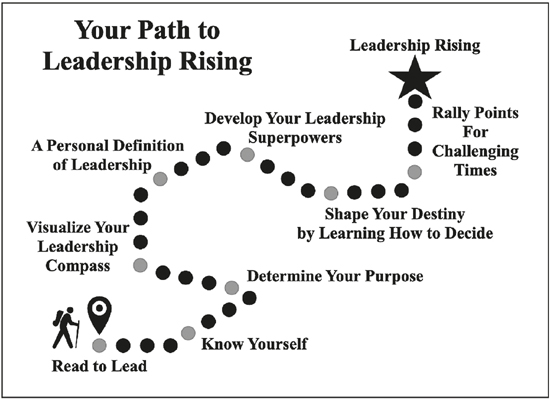
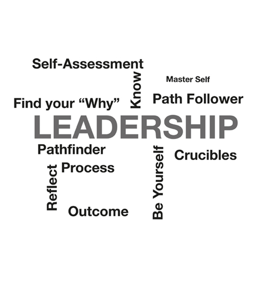

# 前言

*阅读引领*

我的目的是培养领导者和激励服务。目的是所有动机的基础。没有目标，你的目标就缺乏方向。没有目标的领导者，团队就无法到达目的地。如果你有目的地过你的生活，你的行为就会让你朝着一个明确的目标前进。有了目标，你就可以前进、探索和成长。我撰写《领导力崛起》的目的是让你能够提高领导力意识，从而成为一名成功的领导者。
领导力对你来说至关重要，否则你不会选择这本书。领导者将一个群体的势能转化为一个团队的动能。如果你赢得了领导，你就可以赢得生活。
导航你的领导之旅可能很困难。要导航，首先你必须确定你所在的位置。如果你不知道自己在哪里，那么你就迷失了。接下来，你必须决定要走的方向。如果一开始就走错了路，就会浪费宝贵的时间和精力，而且可能会发现自己绕着圈子走，一无所获。通过朝着正确的方向开始，你可以节省时间和精力。此外，你比那些不认识路的人获得了巨大的优势。最后，你必须知道你想去哪里。没有目的地的旅行是没有意义的。
今天，要从一个物理位置导航和移动到另一个物理位置，你可以使用智能手机上的全球定位卫星 (GPS) 网络技术。这使导航变得轻松，因为在你输入目的地后，GPS 会在详细地图上标记你的位置，并为你提供语音提示的逐点方向。你的领导之旅是另一回事。没有 GPS 可以帮助你在领导领域导航。没有任何技术可以取代领导力。领导要求你在平静和危机中全天、每一天都做出全面的、人为的努力。要学习领导，你必须以更传统的方式在这个动荡的领域规划你的路线，首先制定旅程的心理地图，然后制定你自己的内在指南针。当你遵循自己的目标和价值观时，你的指南针就会指向正确的方向。这些共同为你的领导提供位置、方向和目的地。
领导力是激励人们合作和实现目标的最重要因素。如果你的领导水平低，你的生活就会很艰难，因为很难激励人们和你一起工作。如果你的领导水平很高，你可以影响人们实现特定目标。通常，最好的领导者会激励他们的团队实现看似不可能的目标。完成被认为无法实现的事情是伟大领导的魔力。然而，领导力并不是魔法。你不是弹指间就能成就大事的。就像任何有价值的技能的发展一样，提高你的领导能力需要学习、实践和纪律。领导纪律要求坚持不懈的行动以达到预期的结果。纪律赢得行动。就像做俯卧撑一样，你每天锻炼得越多，你就会变得越强壮，因此你能做的俯卧撑就越多。这本书提供了精神上的俯卧撑，可以提高你的领导意识。
领导力不是头衔或职位，它有多种形式。任何有驱动欲望和基本认知能力的人都可以成为领导者。领导力可以来自团队的最新成员，也可以来自最有经验的人。最好的领导者是有效的沟通者，但历史上也有不识字的杰出领导者。相反，也有像莎士比亚那样能言善辩但作为领导者无能的糟糕老板。通过提高你的领导意识，你可以了解差异。
领导力涉及影响人。领导力没有简单的方程式，也没有大规模培养领导者的公式。领导力之旅是内省、教育、经验以及最重要的奉献精神的个人努力。人、团队、团体和组织的类型与夜空中的星星一样多，但如果你愿意参与并改善自己的性格、能力和承诺，就可以提高自己的意识并学习领导他人。不管你的处境、年龄或环境如何，定义你的是你如何崛起、成长和领导。你可以提高你的领导力，增加你成功的机会，并改善追随你的人的生活。如果你的领导力没有得到提升，它就是在萎缩。最终它死了。没有什么比一位经验丰富的领导者的地图已过时且指南针不再指向真实更可悲的了。因此，领导力是你人生各个阶段都需要思考和更新的主题。
在短短的七个章节中，本书将迅速提高你对领导力的认识。杰出的领导者知道时间的价值。一旦一分钟过去，我们就会永远失去它。时间是一种无法储存的有限资产。时间不仅仅是金钱；时间是衡量一切的尺度。一天有 24 小时，但很少有人充分利用这些时间。浪费时间就是浪费生命。因此，赢得时间就是赢得生命。作为领导者，滥用他人的时间不仅会浪费他们的时间，还会浪费他们的生命，因为我们以小时、天和年来衡量生命。 “时间是人类生存中最宝贵的元素，”作家、国家级高水平绩效和个人发展权威丹尼斯·韦特利 (Denis Waitley) 写道。 “成功的人知道如何将精力投入时间，如何从时间中汲取成功。”通过成功的行动，你可以为自己、你领导的人以及从你交付或生产的产品中受益的人赢得时间。
领导力崛起将领导力描述为一门人类艺术而不是一门科学，因为没有可以大规模培养领导者的方程式或逐步过程。成为一名有能力的艺术家需要一套独特的技能和掌握这些技能的纪律。领导力是一种成熟的技能。即使在最好的环境中也很难复制领导力，而一些最好的领导力学校也培养出了糟糕的领导者。因为它是一门艺术，所以必须学习、体验和实践。没有人是天生的领导者，尽管有些人具有先天优势，但领导者最终是白手起家的。此外，领导环境也在不断变化。在一种环境中有效的领导在另一种环境中可能不起作用。每一次领导力互动都会产生许多结果，因为它涉及与具有自由意志的人的人际互动。如果你把人们当作“替代品”来对待，并一遍又一遍地应用同样的领导力秘诀，你就表明你不知道如何领导。你必须适应每一个新的领导力挑战。所有团队都不同，每个团队都由独特的个人组成，并且大多数情况都是不同的。如果没有内在和持续的动力来改善性格、能力和承诺，你的领导力就会停滞不前。你的指南针指向正确，你可能处于正确的方位角，但你需要为每种独特情况创建一张新地图。领导力涉及出于正确的原因，为你和你所领导的人始终如一地采取正确行动的纪律。

在本书中，你将识别、衡量和开发方法来提高你的领导力。第一章“认识你自己”的重点是激励你反思你是谁，批判性地审视自己。了解，然后做你自己，比你想象的要难，因为它需要对你的弱点和优势进行清晰而诚实的评估。第二章，“确定你的目的”，将让你专注于确定这个开创性的目标。这似乎是一项艰巨的任务，但只有你从不尝试，这才是不可能的。你每天所做的选择要么推动你实现目标，要么不实现。如果你希望你的选择有意义，请了解你的目的。第三章，“可视化你的领导力指南针”，挑战你在头脑中看待领导力，并创建一个模型来指导你的思考。最好的领导者将可视化发展为一项基本技能，你可以学习如何做到这一点。在第四章“领导力的个人定义”中，你将通过制定一个既有说服力又有描述性的个人定义来阐明你对领导力的理解。你听过这样一句话：“说到做到，走在路上。”你必须支持你所说的，不仅仅是用语言，而是用行动。如果你不能告诉人们你个人如何定义领导力，你怎么能希望运用你的愿景和目标来领导他人？第五章“培养你的领导超能力”，需要反省和分析，以发现你的先天技能，解锁你的个人“超能力”。你可能没有意识到这一点，但你拥有超能力，可以激发你的领导能力并增强你的领导能力。我们所有人都可以释放出至少一种超能力。
第六章“通过学习如何决定来塑造你的命运”，挑战你回顾你如何决定。领导决定。你决策的质量和及时性通常决定你团队的成败。很少有人会跟随失败者很长时间。他们期望他们的领导者赢得并扩大他们的努力，而不是浪费他们。如果你未能做出决定或一直做出糟糕的决定，则没有人愿意跟随你。第七章“挑战时刻的集结点”总结了我们对领导力的讨论，并列出了一个“集结点”列表，这些“集结点”可以决定你作为领导者的成败。领导力集结点是一种精神触发点，可以将领导者的原则、性格、能力和承诺集中在某个目标上。了解这些集结点，它们将为你提供成功的建议。最好的领导者在他们的领导之旅中借用或开发集结点。无论你是为自己的特定目的采用或调整这些指导方针，还是开发自己的指导方针，都无关紧要。重要的是你有一张个人领导力地图和指南针，可以引导你到达关键的集结点，这将指导你提高领导力意识和能力的旅程。
如果你是一位新兴的领导者，本书将为你提供思维导图和内部指南针，以在你的领导之旅中保持方向。你的思维导图将勾勒出领导层的轮廓，你在心中创建的指南针将提供方向，你的目标会产生目的地。随着你获得更多经验，你将添加到地图中，增强你对领导环境的了解并填补任何空白。随着你继续获得作为领导者的经验，你将更加自信地遵循你的指南针，并且你将了解它是否正确。如果是，请遵循它。如果没有，请重新对齐。当你区分对错时，你就校准了指南针。忽略这一点，后果自负。
如果你是一位经验丰富的领导者，这本书也适合你。你将在以下页面中找到强化、确认和一系列知识点，以添加到你现有的认知地图和指南针中。作为一名经验丰富的领导者，你理解阅读以领导的必要性。你是一名终身学习者，并一直在寻找更好地指导、教导和指导自己和他人的方法。作为一名经验丰富的领导者，你会发现这本书对培养具有各个技能和意识水平的其他领导者以及抓住每一个机会非常有用。经验丰富的领导者有责任培养和培养下一代领导者。当你在组织中培养领导者时，人们会注意到，他们会看到你是一个培养其他领导者的领导者。他们会想和你一起工作，因为他们知道他们会在你的指导下学习和成长。
我们的世界瞬息万变，变化的步伐也在加快。工作的本质、领导力以及作为人的意义，将在未来几天发生变化。在过去，领导力是人类级联进化中的一个常数。没有领导的地方，人民就灭亡了。在有有效领导的地方，他们蓬勃发展。没有有效领导的团队失败了。个人或团体可以发挥领导作用，但如果它不存在，则几乎没有进展，而且往往是混乱。通过继续迎接领导力挑战和学习，最大限度地提高你对生活的影响。学习领导很难，但至关重要。在一个瞬息万变的时代，我们的世界比以往任何时候都更需要有效的领导者。
你可以通过提高你的意识来提高你的领导力。意识包括对与时间和资源相关的领导环境和事件的理解、对其意义的感知以及对他们未来状态的预测。由于领导力是动态的，未来的状态是不断变化的。你昨天做的就是昨天的新闻。你今天的领导能力是对你效率的考验。你应对明天挑战的能力是衡量你影响力的标准。你个人故事的遗产是你如何领导和迎接生活的挑战。最好的领导者通过终身学习来提高他们的领导技能。他们努力成为“无所不知”的人，而不是“无所不知”的人。他们明白领导者必须通过阅读来领导。阅读是一种增强智力的运动。你对领导力读得越多，你的意识就越强。你的意识越强，你就越有可能采取正确的行动。最好的领导者采用终身阅读和学习的纪律。
你决定你的领导力上升到多高。 无论你是一个多么有经验或缺乏经验的领导者，这都无关紧要。 研究、定义和反思使每位领导者受益。 杰出的领导者不断制定更好的定义以产生理解。 他们一直努力反思以了解自己。 他们坚持想象如何更有效地领导和沟通。 他们从每一次失败和每一次成功中学习，从不让失败阻止他们。 在此过程中，他们提高了激励员工的能力，并提高了做出及时、成功决策的技能。 我相信这本书会提高你的意识，提高你的领导力，提升你的生活。 利用这种认可使你自己、你的家人、团队或企业、你的社区和国家以及共同利益受益。
-- 约翰·安塔尔

