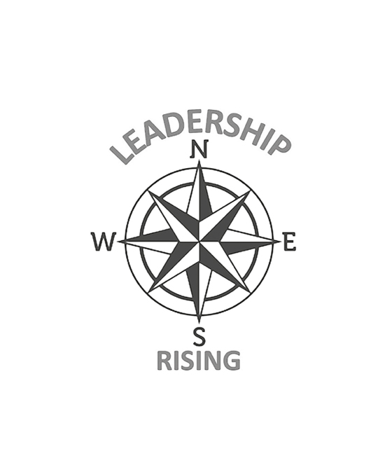

# 致谢

每本书都是很多人的作品。我要感谢那些帮助将《领导力崛起》从思想转变为出版物的人。首先，我要感谢我的妻子 Uncha Antal。她是我火的燃料，是我一生的挚爱。有她，一切皆有可能。其次，我要感谢我的好朋友 Francis Fierko 和 Rick Jung，感谢他们的忠告、智慧和精湛的剪辑。 Fran 是一位出色的领导者，也是一位专家级编辑，他在帮助撰写稿件方面所做的努力具有决定性意义。 Rick 也是将作品从草稿转换为最终版本的核心，他阅读了每一个字并指出了我的不足。我还要感谢许多人花时间阅读、评论并就如何改进我在最终草案之前分发的初步版本提出建议。其中包括按字母顺序排列的 James 和 Beth Antal、Edward Braese、Ray Dishaw、Shawn Graves 和 Carolyn Petracca。最后，我感谢 Ruth Sheppard、Alison Griffiths、Megan Yates 和 Casemate Publishers 的整个团队的编辑和建议。我非常感谢你们所有人。

提高你的意识。
提高你的领导力。
提高你的生活。